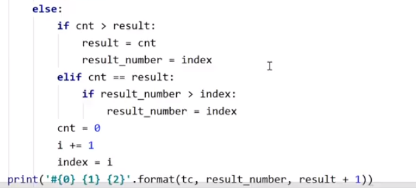

# 1861. 정사각형 방

주변이 전부 다른 숫자이다.


연속한 1의 길이 / 연속한 1의 길이 + 1

오른쪽부터 가면 쉽게 찾을 수 있다.

```python
di = [-1, 1, 0, 0]
dj = [0, 0, -1, 1]
T = int(input())
for tc in range(1, T+1):
    N = int(input())
    rm = [list(map(int, input().split())) for _ in range(N)]
    v = [0]*(N**2 + 1)

    for i in range(N):
        for j in range(N):
            for k in range(4):
                ni, nj = i + di[k], j + dj[k]
                if 0 <= ni < N and 0 <= nj < N:
                    if rm[ni][nj] == rm[i][j] + 1:
                        v[rm[i][j]] = 1
    cnt = 0
    st = 0
    maxV = 0
    for i in range(N**2, -1, -1):
        if v[i] == 1:
            cnt += 1
        else:
            if maxV <= cnt:
                maxV = cnt
                st = i + 1
            cnt = 0

    print('#{} {} {}' .format(tc, st, maxV + 1))
```


간단한 dfs


선생님 방법





왼쪽부터 돌리는


```python
def f(si, sj):
    q = [(si, sj)]
    cnt = 0
    while q:
        i, j = q.pop()
        cnt += 1
        for di, dj in (-1, 0), (1, 0), (0, 1), (0, -1):
            ni, nj = i + di, j + dj
            if 0 <= ni < N and 0 <= nj < N:
                if A[ni][nj] == A[i][j] + 1:
                    q.append((ni, nj))
    return cnt

T = int(input())
for tc in range(1, T+1):
    N = int(input())
    A = [list(map(int, input().split())) for _ in range(N)]

    maxV = 0
    room = N**2
    for i in range(N):
        for j in range(N):
            result = f(i, j)
            if maxV < result:
                maxV = result
                room = A[i][j]
            elif result == maxV and A[i][j] < room:
                maxV = result
                room = A[i][j]

    print('#{} {} {}' .format(tc, room, maxV))
```

```python
def f(i, j):
    global N
    di = [0, 1, 0, -1]
    dj = [1, 0, -1, 0]

    maxV = 0
    for m in range(4):
        ni = i + di[m]
        nj = j + dj[m]
        if 0 <= ni < N and 0 <= nj <N:
            if room[ni][nj] == room[i][j] + 1:
                r = f(ni, nj)
                if maxV < r:
                    maxV = r
    return maxV + 1


T = int(input())
for tc in range(1, T+1):
    N = int(input())
    room = [list(map(int, input().split())) for _ in range(N)]
    visited = [[0]*N for _ in range(N)]

    maxV = 0
    for i in range(N):
        for j in range(N):
            visited[i][j] = f(i, j)
            if visited[i][j] > maxV:
                maxV = visited[i][j]

    minV = 10000000
    for i in range(N):
        for j in range(N):
            if visited[i][j] == maxV:
                if room[i][j] < minV:
                    minV = room[i][j]
    print('#{} {} {}' .format(tc, minV, maxV))
```

```python
def find(col, row, N):
    dc = [0, 1, 0, -1]
    dr = [1, 0, -1, 0]
    D[col][row] = 1
    q = []
    q.append((col, row))
    maxV = 1
    while q:
        ac, ar = q.pop()
        for i in range(4):
            nc = ac + dc[i]
            nr = ar + dr[i]
            if 0 <= nc < N and 0 <= nr < N:
                if building[nc][nr] == building[ac][ar] + 1:
                    if D[nc][nr] < D[ac][ar] + 1:
                        q.append((nc, nr))
                    D[nc][nr] = max(D[nc][nr], D[ac][ar] + 1)
                    if maxV < D[nc][nr]:
                        maxV = D[nc][nr]
    return maxV


t = int(input())
for tc in range(1, t + 1):
    N = int(input())
    building = [list(map(int, input().split())) for i in range(N)]
    maxV = 0
    minn = 10000000
    D = [[0] * N for i in range(N)]
    for i in range(N):
        for j in range(N):
            nowV = find(i, j, N)
            if maxV < nowV:
                maxV = nowV
                minn = building[i][j]
            elif maxV == nowV:
                if minn > building[i][j]:
                    minn = building[i][j]

    print("#{} {} {}".format(tc, minn, maxV))
```

```python
def f(a,b):
    cnt = 1
    di = [0,1,0,-1]
    dj = [1,0,-1,0]
    q = [(a,b)]
    while q !=[]:
        i,j=q.pop()
        for k in range(4):
            ni = i+di[k]
            nj = j+dj[k]
            if ni >=0 and ni <N and nj >=0 and nj <N and arr[ni][nj] == arr[i][j]+1:
                if memoi[ni][nj] > 0:
                    cnt+=memoi[ni][nj]
                else:
                    cnt+=1
                    q.append((ni,nj))
    return cnt
 
for t in range(int(input())):
    N = int(input())
    arr = [list(map(int, input().split())) for _ in range(N)]
    memoi = [[0]*N for _ in range(N)]
    Roomnumber = 10000000
    maxM = 0
    for i in range(N):
        for j in range(N):
            if arr[i][j] <= (N * N - maxM):
                a=f(i,j)
                memoi[i][j] = a
                if maxM < a:
                    maxM = a
                    Roomnumber = arr[i][j]
                elif maxM == a:
                    Roomnumber = min(Roomnumber, arr[i][j])
    print('#'+str(t+1), Roomnumber, maxM)
```


```python
def BFS(i, j):
    global max_count, max_room
    global N
    global rooms
 
    q = [(i, j)]
 
    while q:
        i_, j_ = q.pop(0)
 
        d = [(0, 1), (0, -1), (1, 0), (-1, 0)]
        for dx, dy in d:
            ni = i_ + dx
            nj = j_ + dy
 
            if 0 <= ni < N and 0 <= nj < N:
                if rooms[ni][nj] == rooms[i_][j_] + 1:
 
                    max_d = visited[ni][nj]
                    # 아직 방문하지 않았거나
                    # 이미 최대거리가 있지만, 그 값이 이제와서 생긴 최대거리보다 작다면
                    if 1 <= max_d < visited[i_][j_] + 1:
                        visited[ni][nj] = visited[i_][j_] + 1
                        if visited[ni][nj] > max_count:
                            max_count = visited[ni][nj]
                            max_room = rooms[i][j]
                        elif visited[ni][nj] == max_count:
                            if rooms[i][j] < max_room:
                                max_room = rooms[i][j]
                        q.append((ni, nj))
 
 
T = int(input())
for tc in range(1, T + 1):
    N = int(input())
    rooms = [list(map(int, input().split())) for _ in range(N)]
    max_room = 0
    max_count = 0
    visited = [[1] * N for _ in range(N)]
    for i in range(N):
        for j in range(N):
            if visited[i][j] == 1:
                BFS(i, j)
 
    print("#{} {} {}".format(tc, max_room, max_count))
```

```python
def dfs(i, j):
    global maxV, minV
    s = []
    s.append([i, j])
    cnt = 0
    while s:
        x, y = s.pop()
        if memo[x][y] != 0:
            cnt += memo[x][y]
            break
        for k in range(4):
            ni, nj = x + dx[k], y + dy[k]
            if 0 <= ni < N and 0 <= nj < N and room[x][y] + 1 == room[ni][nj]:
                s.append([ni, nj])
                cnt += 1
                break
    memo[i][j] = cnt
    if maxV <= cnt and cnt != 0:
        if maxV < cnt:
            minV = room[i][j]
        else:
            if minV > room[i][j]:
                minV = room[i][j]
        maxV = cnt


dx = [0, 1, 0, -1]
dy = [1, 0, -1, 0]
T = int(input())
for t in range(1, T + 1):
    N = int(input())
    room = [list(map(int, input().split())) for _ in range(N)]
    maxV = 1
    minV = N * N
    memo = [[0] * N for _ in range(N)]
    for i in range(N):
        for j in range(N):
            dfs(i, j)
    print("#{} {} {}".format(t, minV, maxV + 1))
```

