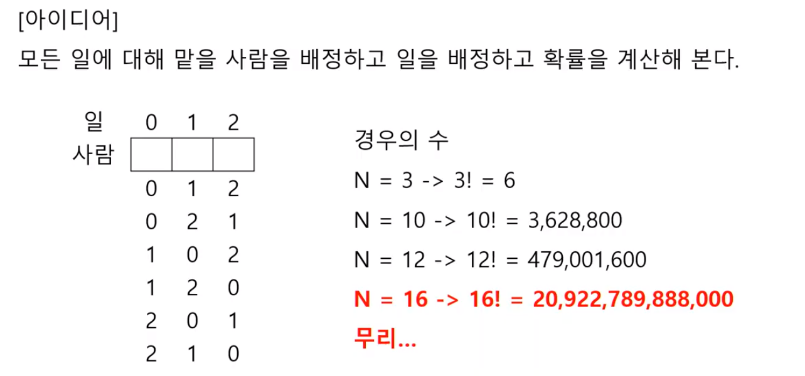
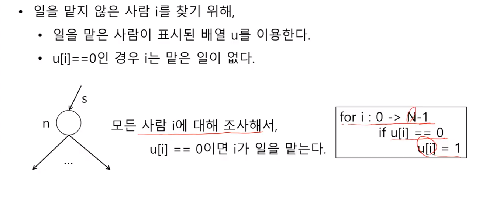
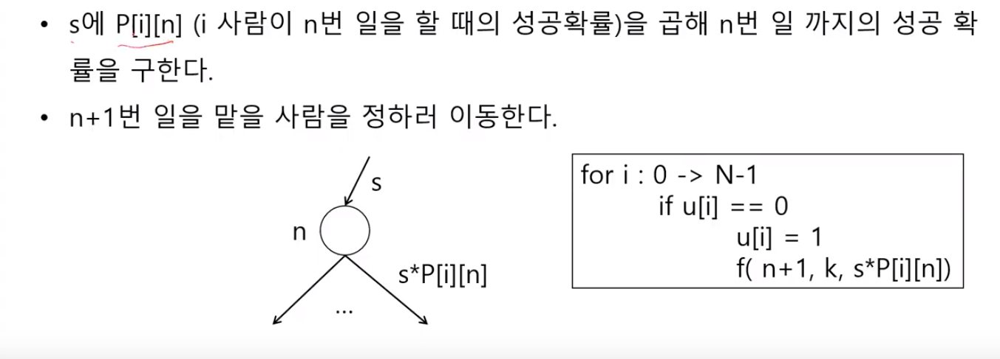
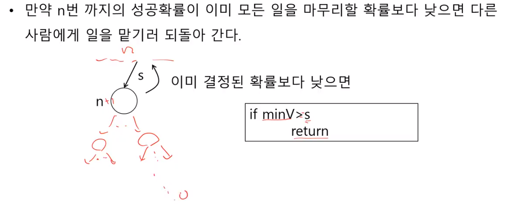
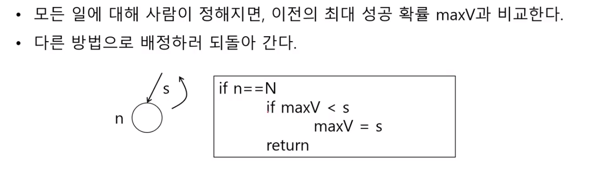
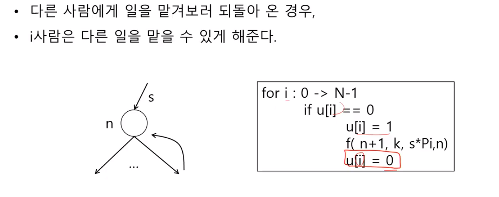

# 1865. 동철이의 일 분배













### 선생님 코드

```PYTHON
def f(n, k, s):
    global maxV, u, w, P
    
   	if n == k:
        if maxV < s*100:
            maxV = s*100
   	elif maxV >= s*100:
        return
    else:
        for i in range(k):
            if u[i] == 0:
                u[i] = 1  # i번 사람이 n번 일을 맡음
                f(n+1, k, s * P[i][n]/100)  # n번 까지의 성공확률 계산
                u[i] = 0  # 다른 일을 맡도록 함

T = int(input())
for tc in range(1, T+1):
    N = int(input())
    P = [list(map(int, input().split())) for _ in range(N)]
    U = [0]*N
    W = [0]*N
    maxV = 0
    f(0, N, 1)
    print('#{} {:.6f}' .format(tc, maxV))
```

### 내 코드

```python
def f(idx, n, work):
    global maxV
    
    if idx == n:
        if maxV < work:
            maxV = work
    elif maxV >= work:
        return
    else:
        for i in range(n):
            if visited[i] == 0:
                visited[i] = 1
                f(idx+1, n, work * P[idx][i]/100)
                visited[i] = 0

T = int(input())
for tc in range(1, T+1):
    N = int(input())
    P = [list(map(int, input().split())) for _ in range(N)]
    visited = [0]*N

    maxV = 0
    f(0, N, 1)
    print('#{} {:.6f}' .format(tc, maxV*100))
```

### DP

```PYTHON
def toSet(num):
    return { idx for idx, val in enumerate(bin(num)[:1:-1]) if val == '1' }
  
T = int(input())
for test in range(1, T+1):
    N = int(input())
    arr = [list(map(lambda x: int(x)/100, input().split())) for _ in range(N)]
     
    ans = [1] + [0]*((1<<N) - 1)
    size = [bin(i).count('1') for i in range(1<<N)]
    for R in range(N):
        for i in range(1<<N):
            if size[i] == R+1:
                ans[i] = max([ arr[R][C] * ans[i & ~(1<<C)] for C in toSet(i) ])
 
    print('#{} {:.6f}'.format(test, ans[-1]*100))
```

