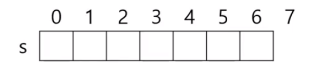
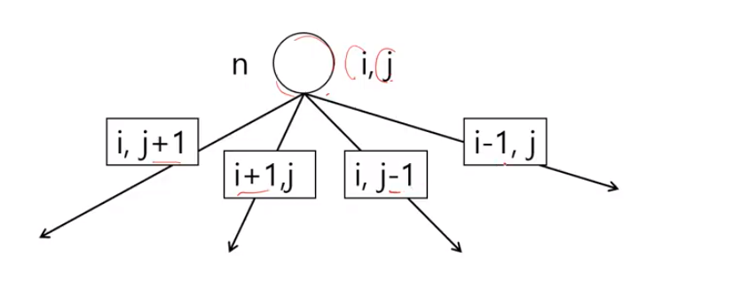
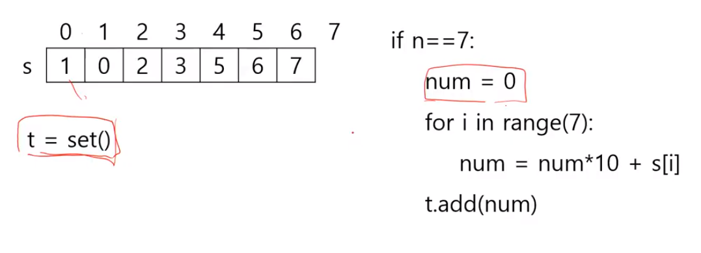
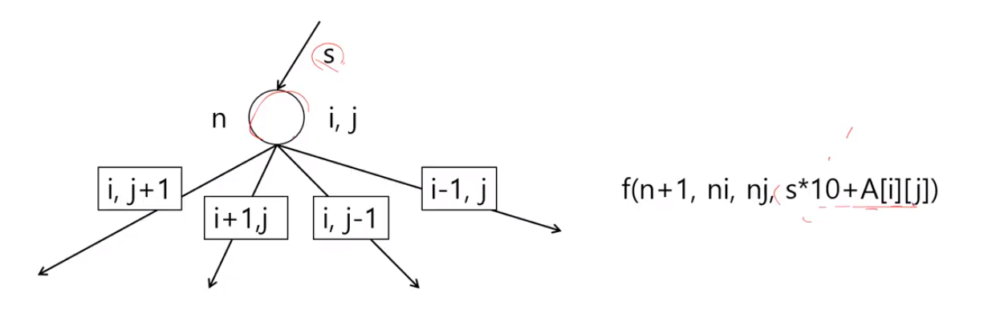

# 2819. 격자판의 숫자 이어 붙이기

## 아이디어 

- 배열 s에 7개의 숫자를 채운다.
- f(n, i, j)에서 s[n]에 격자판 i, j의 숫자를 복사한다.



- set()

- f(n, i, j)



```python
di = [0, 1, 0, -1]
dj = [1, 0, -1, 0]
for k in range(4):
    ni = i + di[k]
    nj = j + dj[k]
    for 0 <= ni < 4 and 0 <= nj < 4:
        
```

- 배열에 저장된 개별 숫자를 정수로 바꾸기



- [아이디어1] 배열을 채우는 대신 숫자 s를 만들어 다음 단계에 전달




## 내 코드

```python
def dfs(i, j, cnt, num):
    global number

    if cnt == 7:
        number.add(num)
        return
    else:
        for di, dj in (-1, 0), (1, 0), (0, -1), (0, 1):
            ni, nj = i + di, j + dj
            if 0 <= ni < 4 and 0 <= nj < 4:
                dfs(ni, nj, cnt + 1, num + arr[ni][nj])

T = int(input())
for tc in range(1, T + 1):
    arr = [list(input().split()) for _ in range(4)]

    number = set()
    for i in range(4):
        for j in range(4):
            dfs(i, j, 1, arr[i][j])

    print('#{} {}' .format(tc, len(number)))
```


## 선생님 코드

```python
def find(i, j, n, s):
    di = [0, 1, 0, -1]
    dj = [1, 0, -1, 0]

    if n == 7:
        t.add(s)
    else:
        for k in range(4):
            ni = i + di[k]
            nj = j + dj[k]
            if ni >= 0 and ni < 4 and 0 <= nj and nj < 4:
                find(ni, nj, n + 1, s + str(a[i][j]))

T = int(input())
for tc in range(1, T + 1):
    a = [list(map(int, input().split())) for _ in range(4)]
    t = set()
    for i in range(4):
        for j in range(4):
            find(i, j, 0, '')

    print('#{} {}' .format(tc, len(t)))
```


```
list는 append()함수를 이용해서 추가하지만,

set은 add()함수를 이용해서 추가할 수 있다.


list내부 검사할 때 in을 이용하는데 list가 순차적으로 접근하는 배열이기 때문에 시간이 많이 걸린다.

그래서 set을 이용하여 시간을 줄였습니다.


방향을 4가지로 나눠서 함수를 정의해야했는데 재귀함수를 이용하여 다른 4방향으로 이동하였습니다. 
```