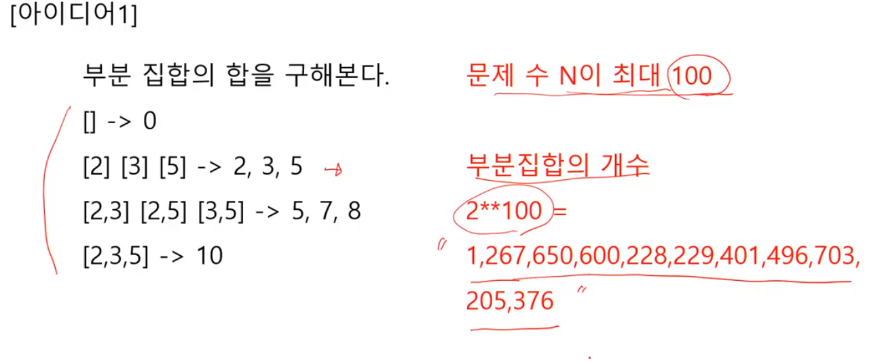
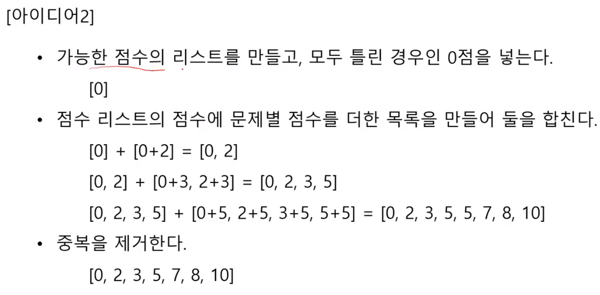
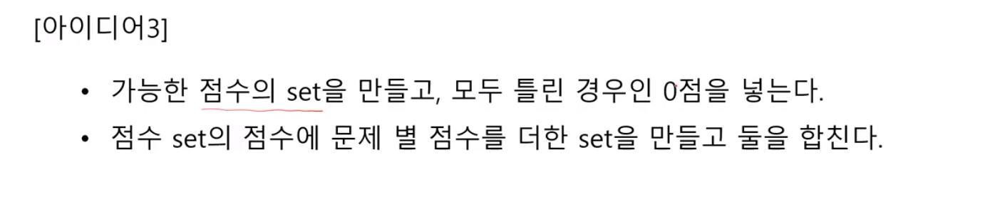
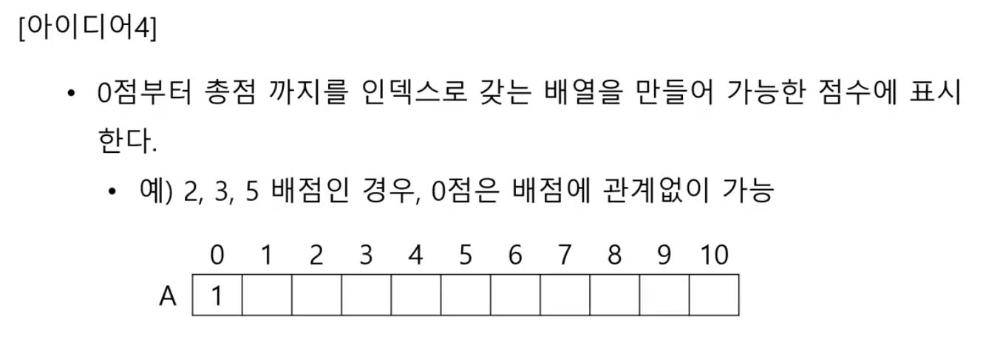
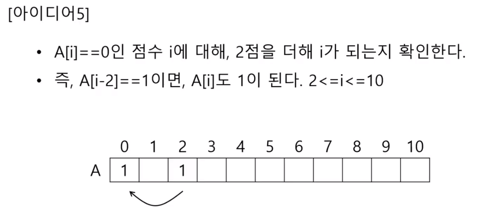
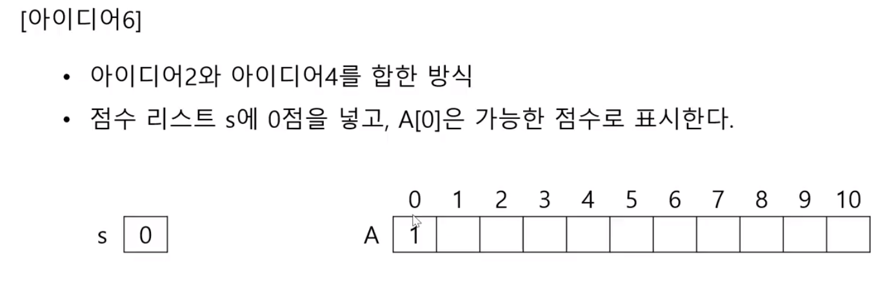

# 3752. 가능한 시험 점수



사용하고 안하고를 하는 문제가 아님

=> 일단 할 수 없음...




문제점 : 같은 점수가 많아질 수록 리스트가 엄청 커질 수 있다.

```python
T = int(input())
for tc in range(1, T+1):
    N = int(input())
    p = list(map(int, input().split()))
    ans = [0]
    for x in p:
        num = []
        for y in ans:  # 가능한 점수
            num.append(x+y)
        ans += num
    print('#{} {}' .format(tc, len(set(ans))))
```

=> Fail(Runtime error)




```python
T = int(input())
for tc in range(1, T+1):
    N = int(input())
    p = list(map(int, input().split()))
    ans = set([0])
    for x in p:
        num = set()
        for y in ans: 
            num.add(x+y)
        ans = set(list(ans) + list(num))
    print('#{} {}' .format(tc, len(set(ans))))
```




오른쪽 부터 탐색을 시작해야한다.

```python
T = int(input())
for tc in range(1, T+1):
    N = int(input())
    p = list(map(int, input().split()))
    total = sum(p)
    s = [0]*(total+1)
    s[0] = 1
    for x in p:
        for i in range(total - x, -1, -1): 
            #if s[i] == 1:
            #    s[i+x] = 1
            s[i+x] = s[i+x] | s[i]
    print('#{} {}' .format(tc, sum(s))
```







s[0] input2  A[1, 0, 1, ...] => s[0, 2]

s[0, 2] input3  A[1, 0, 1, 1,....] => s[0, 2, 3]


## 내 코드

내 코드는 아이디어4랑 비슷한듯

```python
for tc in range(1, int(input()) + 1):
    N = int(input())
    num = list(map(int, input().split()))
    maxN = 100*N + 1
    check = [0]*maxN
    check[0] = 1

    result = 1
    for i in range(N):
        for j in range(maxN - 1, -1, -1):
            if check[j] == 1 and check[j + num[i]] == 0:
                check[j + num[i]] = 1
                result += 1

    print('#{} {}' .format(tc, result))
```


## 예전 정리글

```python
# 중복 값 제거(set이용)
T = int(input())
for tc in range(1, T+1):
    N = int(input())
    score = list(map(int, input().split()))

    all = set([0])
    for i in score:
        temp = set(all)
        for j in temp:
            all.add(i+j)

    print('#{} {}' .format(tc, len(all)))
```

```python
# 중복 값 제거(list이용)
T = int(input())
for tc in range(1, T + 1):
    N = int(input())
    score = list(map(int, input().split()))

    all_1 = [0]*(sum(score)+1)
    all_score = [0]
    for i in score:
        for j in range(len(all_score)):
            if not all_1[all_score[j]+i]:
                all_score.append(all_score[j] + i)
                all_1[all_score[j]+i] = 1

    print('#{} {}' .format(tc, len(all_score)))
```

```python
# 모든 경우의 수
T = int(input())
for tc in range(1, T + 1):
    N = int(input())
    score = list(map(int, input().split()))

    all_score = [0]
    for i in score:
        for j in range(len(all_score)):
            all_score.append(all_score[j] + i)
            
	print('#{} {}' .format(tc, len(all_score)))
```


```python
all = set([0])
>>> {0}
```

set함수는 iterable한 값만 받을 수 있기 때문에 정수형 0을 넣을 수 없다.

그래서 리스트를 씌어주어 만들어 준다.([]는 출력되지 않는다.)

```python
a = set([0])
a.update([1])
print(a)
>>>{0, 1}
```

리스트를 추가하고 싶으면 update()함수를 사용 한다.

```python
a = set([0])
a.add(1)
print(a)
>>> {0, 1}
```

정수형을 추가하고 싶으면 add()함수를 사용한다.