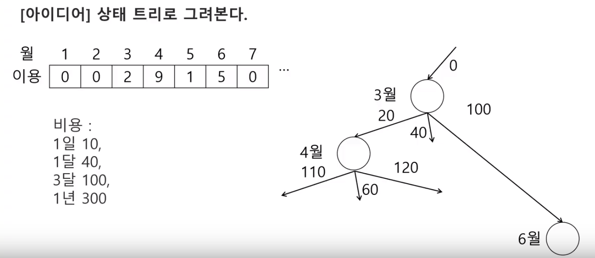

# 1952. [모의 SW 역량테스트] 수영장



### 재귀

```python
def f(n, c, d, m, m3):
    global minV
    
    if n >= 13:
        if minV > c:
            minV = c
   	elif minV <= c:
        return
    else:
        # 1일 사용권과 한달 사용권 비교
        f(n + 1, c + min(d*table[n], m), d, m, m3)
        f(n + 3, c + m3, d, m, m3) # n월에 3달 이용권


T = int(input())
for tc in range(1, T+1):
    d, m, m3, y = map(int, input().split())  # 이용권 비용
    table = [0] + list(map(int, input().split()))  # 월별 이용일
    minV = y   # 1년 이용권 비용
    f(1, 0, d, m, m3)  # 1월부터 고려
    print('#{} {}' .format(tc, minV))
```

```PYTHON
def f(n, c, d, m, m3):
    global minV
    
    if n >= 13:
        if minV > c:
            minV = c
    else:
        f(n + 1, c + d*table[n], d, m, m3) # n월에 1일 이용권
        if table[n] > 0:
        	f(n + 1, c + m, d, m, m3) # n월에 1달 이용권
        f(n + 3, c + m3, d, m, m3) # n월에 3달 이용권


T = int(input())
for tc in range(1, T+1):
    d, m, m3, y = map(int, input().split())  # 이용권 비용
    table = [0] + list(map(int, input().split()))  # 월별 이용일
    minV = y   # 1년 이용권 비용
    f(1, 0, d, m, m3)  # 1월부터 고려
    print('#{} {}' .format(tc, minV))
```


```python
def f(n, c):
    global minV

    if n >= 12:
        if c < minV:
            minV = c
            return
    else:
        f(n + 1, c + d*pool[n]) 
        f(n + 1, c + m)
        f(n + 3, c + m3)
        f(n + 12, c + y)


T = int(input())
for tc in range(1, T+1):
    d, m, m3, y = map(int, input().split())
    pool = list(map(int, input().split()))

    minV = 100000
    f(0, 0)
    print('#{} {}' .format(tc, minV))
```

### DP

```python
T = int(input())
 
for tc in range(1, T + 1):
    day, month_1, month_3, year = map(int, input().split())
    plan = [0] + list(map(int, input().split()))
 
    min_price = year  # 1년권
    dp = [0] * 13  # 1 ~ 12월
 
    for month in range(1, 13):  # 1월부터 12월까지,
        if month <= 2:  # 1월에서 2월까지는
            # 해당 월의 dp값 = 이전 월의 dp값 + 최소(일권사용 , 1달권사용)
            dp[month] = dp[month - 1] + min(plan[month] * day, month_1)
        else:  # 3월부터는, 최소(이전 월의 dp값 + 최소(일권사용 , 1달권사용) , 3달전의 dp값 + 3달권)
            dp[month] = min(dp[month - 1] + min(plan[month] * day, month_1), dp[month - 3] + month_3)
 
    if dp[-1] < min_price:
        min_price = dp[-1]
 
    print("#{} {}".format(tc, min_price))
```

