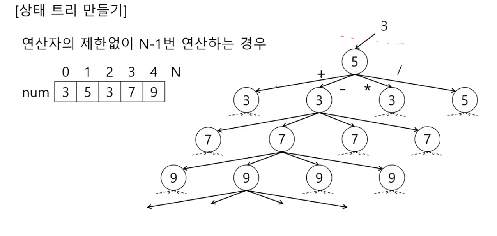
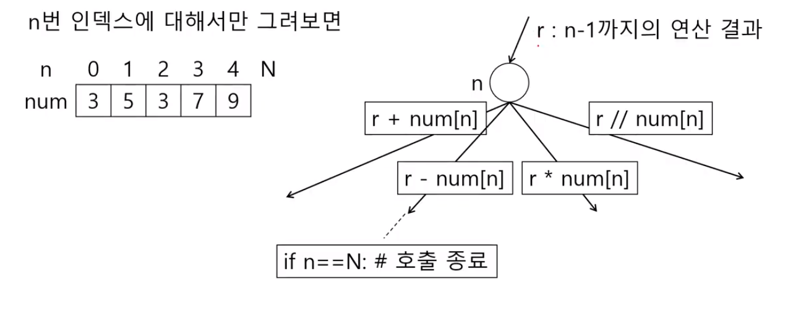
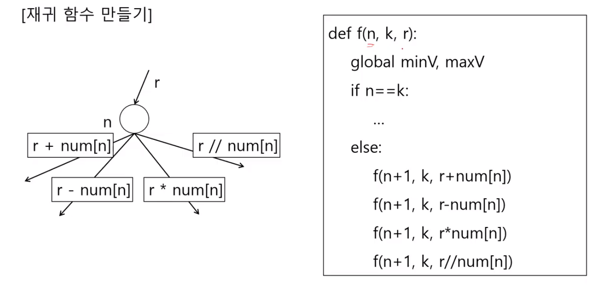
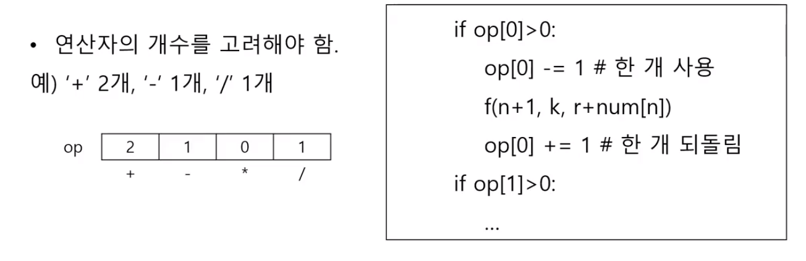
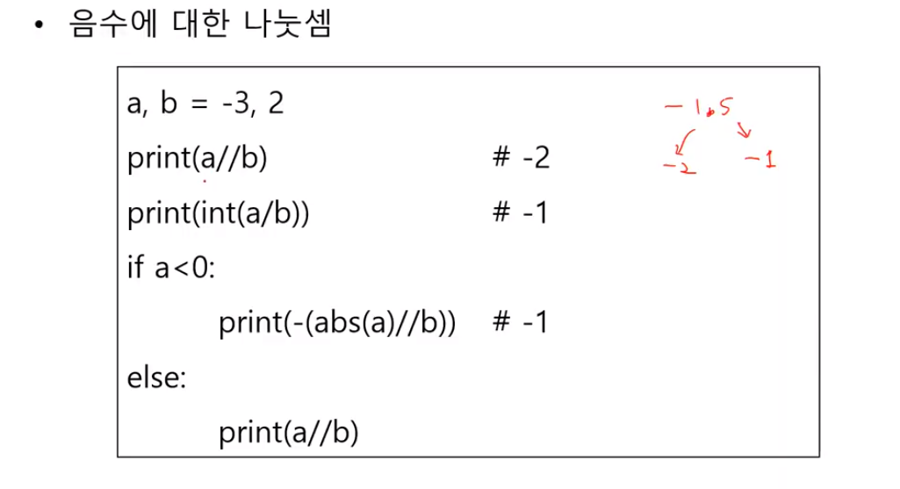

# 4008. [모의 SW 역량테스트\] 숫자 만들기











```python
def f(n, k, r, op1, op2, op3, op4):
    global minV, maxV
    
    if n == k:
        if minV > r:
            minV = r
        if maxV < r:
            maxV = r
    else:
        if op1 > 0:
            f(n + 1, k, r + arr[n], op1 - 1, op2, op3, op4)
        if op2 > 0:
            f(n + 1, k, r - arr[n], op1, op2 - 1, op3, op4)
        if op3 > 0:
            f(n + 1, k, r * arr[n], op1, op2, op3 - 1, op4)
        if op4 > 0:
            f(n + 1, k, int(r/arr[n]), op1, op2, op3, op4 - 1)

T = int(input())
for tc in range(1, T+1):
    N = int(input())   # 숫자의 개수
    op1, op2, op3, op4 = map(int, input().split())   # 카드의 개수 + - * /
    arr = list(map(int, input().split()))   # N개의 숫자

    minV = 10000000000000
    maxV = -1000000000000
    f(1, N, arr[0], op1, op2, op3, op4)

    print('#{} {}' .format(tc, maxV - minV))
```


```python
def f(n, k, r):
    global minV, maxV
    if n == k:
        if minV > r:
            minV = r
        if maxV < r:
            maxV = r
    else:
        if card_cnt[0] > 0:
            card_cnt[0] -= 1
            f(n + 1, k, r + arr[n])
            card_cnt[0] += 1
        if card_cnt[1] > 0:
            card_cnt[1] -= 1
            f(n + 1, k, r - arr[n])
            card_cnt[1] += 1
        if card_cnt[2] > 0:
            card_cnt[2] -= 1
            f(n + 1, k, r * arr[n])
            card_cnt[2] += 1
        if card_cnt[3] > 0:
            card_cnt[3] -= 1
            f(n + 1, k, int(r/arr[n]))
            card_cnt[3] += 1

T = int(input())
for tc in range(1, T+1):
    N = int(input())   # 숫자의 개수
    card_cnt = list(map(int, input().split()))   # 카드의 개수 + - * /
    arr = list(map(int, input().split()))   # N개의 숫자

    minV = 10000000000000
    maxV = -1000000000000
    f(1, N, arr[0])

    print('#{} {}' .format(tc, maxV - minV))
```

