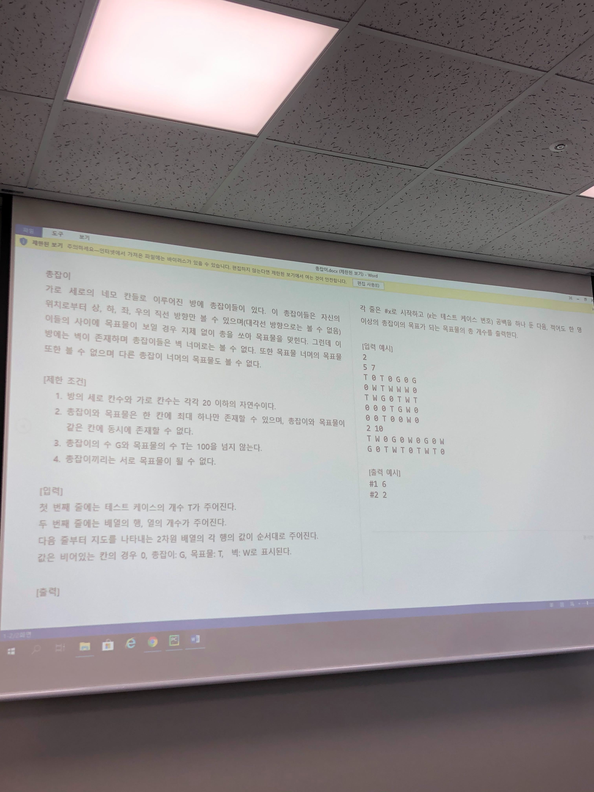

# 총잡이



```
2
5 7
T 0 T 0 G 0 G
0 W T W W W 0
T W G 0 T W T
0 0 0 T G W 0
0 0 T 0 0 W 0
2 10
T W 0 G 0 W 0 G 0 W
G 0 T W T 0 T W T 0
#1 6
#2 2
```


```python
def f(i, j, N, M):
    cnt = 0
    for a in range(1, N):
        ni = i + -1*a
        if 0 <= ni < N:
            if arr[ni][j] == 'T':
                cnt += 1
                arr[ni][j] = 'W'
                break
            elif arr[ni][j] == 'W':
                break
            elif arr[ni][j] == 'G':
                break
    for a in range(1, N):
        ni = i + a
        if 0 <= ni < N:
            if arr[ni][j] == 'T':
                cnt += 1
                arr[ni][j] = 'W'
                break
            elif arr[ni][j] == 'W':
                break
            elif arr[ni][j] == 'G':
                break
    for a in range(1, M):
        nj = j + -1*a
        if 0 <= nj < M:
            if arr[i][nj] == 'T':
                cnt += 1
                arr[i][nj] = 'W'
                break
            elif arr[i][nj] == 'W':
                break
            elif arr[i][nj] == 'G':
                break
    for a in range(1, M):
        nj = j + a
        if 0 <= nj < M:
            if arr[i][nj] == 'T':
                cnt += 1
                arr[i][nj] = 'W'
                break
            elif arr[i][nj] == 'W':
                break
            elif arr[i][nj] == 'G':
                break

    return cnt


T = int(input())
for tc in range(1, T+1):
    N, M = map(int, input().split())
    arr = [list(input().split()) for _ in range(N)]

    cnt = 0
    for i in range(N):
        for j in range(M):
            if arr[i][j] == 'G':
                cnt += f(i, j, N, M)
    print('#{} {}' .format(tc, cnt))
```

