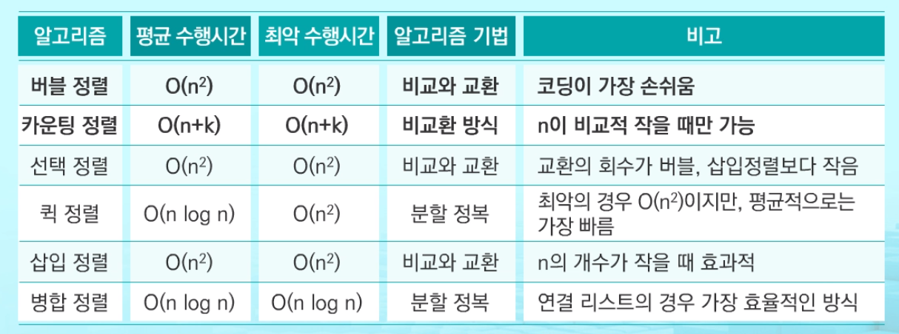

# 정렬

### 정렬이란?

2개 이상의 자료를 특정 기준에 의해 오름차순, 내림차순으로 재배열 하는 것


### 대표적인 정렬 방식의 종류



버블, 선택을 할 줄 알아야함

퀵정렬은 빠름

시간이 여유있으면 버블 선택정렬사용


## 버블 정렬

- 인접한 두 개의 원소를 비교하며 자리를 계속 교환하는 방식
- 첫 번째 원소부터 인접한 원소끼리 계속 자리를 교환하면서 맨 마지막 자리까지 이동한다.
- 한 단계가 끝나면 가장 큰 원소가 마지막 자리로 정렬된다.
- 시간복잡도 : O(n^2)

```
1. 구간정하기
2. 가장 큰 수를 맨 뒤로 보내기
3. 맨 뒤의 수를 빼고 계속 반복
```

```python
def bubblesort(a):  # 정렬할 list
    for i in range(len(a)-1, 0, -1):
        for j in range(0, i):
            if a[j] > a[j+1]:
                a[j], a[j+1] = a[j+1], a[j]
```

```python
n = int(input())
arr = list(map(int, input().split()))

for i in range(n-1, 0, -1): # 정렬 구간의 마지막 인덱스
    for j in range(0, i): # i-1까지
        if arr[j] > arr[j+1]:
            arr[j],arr[j+1]= arr[j+1],arr[j]
print(arr[n//2])
```

```python
n = int(input())
arr = list(map(int, input().split()))

for i in range(n-1, 0, -1): # 정렬 구간의 마지막 인덱스
    for j in range(0, i): # i-1까지
        if arr[j] > arr[j+1]:
            temp = arr[j]
            arr[j] = arr[j+1]
            arr[j+1] = temp
print(arr[n//2])
```


## 카운팅 정렬

- 항목들의 순서를 결정하기 위해 집합에 각 항목이 몇 개씩 있는지 세는 작업을 하여, 선형 시간에 정렬하는 효율적인 알고리즘

- 그런데 정수나 정수로 표현할 수 있는 자료에 대해서만 적용 가능하다.

  각 항목의 발생 회수를 기록하기 위해, 정수 항목으로 인덱스되는 카운트들의 리스트를 사용하기 때문이다.

- 카운트들을 위한 충분한 공간을 할당하려면 집합 내의 가장 큰 정수를 알아야 한다.

- 시간 복잡도 = O(n+k) , n:리스트개수,  k:정수의 최대값

```python
def countingsort(a, b, k):  # k : 리스트에 사용된 가장 큰 숫자
    # a[1....n] : 입력 리스트 사용된 숫자(1~k)
    # b[1....n] : 정렬된 리스트
    # c[1....k] : 카운트 리스트
    c = [0] * k

    # 각 항목들의 발생 회수를 세고, 정수 항목들로 직접 인덱스 되는 카운트 배열
    for i in range(0, len(b)):
        c[a[i]] += 1       # c = [1, 3, 1, 1, 2]

    # 정렬된 집합에서 각 항목의 앞에 '위치'할 항목의 개수를 반영
    for i in range(1, len(c)):
        c[i] += c[i - 1]   # c = [1, 4, 5, 6, 8]

    for i in range(len(b) - 1, -1, -1):
        b[c[a[i]] - 1] = a[i]     # 정렬된 a  b = [0, 1, 1, 1, 2, 3, 4, 4]
        c[a[i]] -= 1       # c = [0, 1, 4, 5, 6]

a = [0, 4, 1, 3, 1, 2, 4, 1]
b = [0] * len(a)
countingsort(a, b, 5)
print(b)
```


## 선택정렬

저장되어 있는 자료로부터 k번째로 큰 or 작은 원소를 찾는 방법

최소값, 최대값, 중간값을 찾는 알고리즘

```
1. 정렬 알고리즘을 이용하여 자료를 정렬
2. 원하는 순서에 있는 원소 가져오기
```

#### 셀렉션 알고리즘

k가 비교적 작을 때 유용, O(kn)의 수행시간

k번째로 작은 원소를 찾는 알고리즘

1번부터 k번째까지 작은 원소들을 찾아 list의 앞쪽으로 이동

```python
def select(list, k):
    for i in range(0, k):
        minindex = i
        for j in range(i+1, len(list)):
            if list[minindex] > list[j]:
                minindex = j
        list[i], list[minindex] = list[minindex],list[i]
    return list[k-1]
```

#### 선택정렬

주어진 자료들 중 가장 작은 값의 원소부터 차례대로 선택하여 위치를 교환하는 방식

셀렉션 알고리즘을 전체 자료에 적용

```
1. 리스트 중에서 최소값을 찾음
2. 그 값을 리스트 맨 앞에 위치한 값과 교환
3. 맨 처음 위치를 제외한 나머지 리스트에서 최소값을 찾아 두번째로 교환
시간복잡도 : O(n^2)
```

```python
def selectionSort(a):
    for i in range(0, len(a)-1):   # 최소값을 찾는 구간의 시작인덱스
        minIdx = i   # 각 구간의 시작인덱스
        for j in range(i+1, len(a)):  # 최소값을 찾는 구간
            if a[minIdx] > a[j]:
                minIdx = j
       	a[i], a[minIdx] = a[minIdx], a[i]
```


## 퀵 정렬

```python
# 퀵정렬 알고리즘
def quicksort(a, begin, end):
    if begin < end:
        p = partition(a, being, end)
        quicksort(a, begin, p-1)     # 피봇보다 작은부분 정렬
        quicksort(a, p+1, end)       # 피봇보다 큰 부분 정렬
```

```python
# hoare-partition
def partition(a, being, end):
    pivot = (begin + end)//2
    L = begin
    R = end
    while L < R:
        while a[L] < a[pivot] and L < R:
            L += 1
        while a[R] >= a[pivot] and L< R:
            R -= 1
        if L < R:
            if L == pivot:
                pivot = R
                a[L], a[R] = a[R], a[L]
   	a[pivot], a[R] = a[R], a[pivot]
    return R
```

```python
# 로무토 파티션
def partition(a, l, r):
    p = a[r]     # x : 오른쪽 끝 값 피봇 설정
    i = l - 1    # i : 시작위치 - 1
    for j in range(l, r):   # j : 시작위치부터 피봇위치 앞까지 증가
        if a[j] <= p:   # 피봇보다 작으면
            i += 1
            a[i], a[j] = a[j], a[i]
    a[i+1], a[r] = a[r], a[i+1]  
   	return i + 1
```

퀵 정렬(b형 준비하는사람 반드시 코드 짜기)

기준 아이템 중심(피봇)으로 작으면 왼쪽, 크면 오른쪽으로 위치시킨다.(파티션)

왼쪽 구간에 대해서 퀵소트

오른쪽 구간에 대해서 퀵소트

반복

모든 아이템이 피봇이 되어 정렬이된다.


## 삽입정렬

정렬되지 않은 부분집합 U의 원소를 하나씩 꺼내서 이미 정렬되어 잇는 부분집합 s의 마지막 원소부터 비교하면서 위치를 찾아 삽입


## 병합 정렬

굉장히 큰 자료형의 구조일 때 사용, 메모리 사용용량이 많다.

분할 정복 알고리즘을 활용

하나가 남을 때까지 반으로 분할하고 그 뒤 합친다.

```python
# 분할 과정
def merge_sort(m):
    if len(m) <= 1:     # 사이즈가 0이거나 1인 경우
        return m
    
    mid = len(m)//2     # divide 
    left = m[:mid]
    right = m[mid:]
    
    left = merge_sort(left)     # 리스트의 크기가 1이 될 때까지 merge_sort 재귀 호출
    right = merge_sort(right)
    
    return merge(left, right)    # 분할된 리스트들 병합
```

```python
# 병합 과정
def merge(left, right):
    result = []  # 두 개의 분할된 리스트를 병합하여 result를 만듦
    
    while len(left) > 0 and len(right) > 0:
        if left[0] <= right[0]:   # 두 서브 리스트의 첫 원소들을 비교하여 작은 것부터 추가
            result.append(left.pop(0))
        else:
            result.append(right.pop(0))
            
   if len(left) > 0:
    	result.extend(left)
   if len(right) > 0:
    	result.extend(right)
   return result
```

