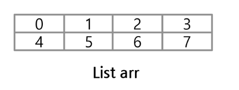

# 배열2 - 2차원 배열

## 2차원 배열의 선언

세로길이(행의 개수), 가로길이(열의 개수)가 필요



```python
arr = [[0,1,2,3],[4,5,6,7]]

arr = [[i,j] for i in rage(1,4) for j in range(4,8)]
```


## 배열 입력 받기

```python
n, m = map(int, input().split())
arr = [[0 for x in range(m)] for y in range(n)]

n, m = map(int, input().split())
arr = [list(map(int, input().split())) for y in range(n)]

n, m = map(int, input().split())
for y in range(n):
    arr[i] = list(map(int, input().split()))
```


## 배열 사용방법

``` python
for i in range(len(Arr)):
    for j in range(len(Arr[i])):
        Arr[i][j] = 1
print(Arr)
```

값을 변경하기 위해서 len을 사용해서 Arr 안에 존재하는 리스트의 갯수르 구한 후에 그 값을 바탕으로 각각의 리스트에 접근하는 방법

```python
for idx_i, val_i in enumerate(Arr):
    for idx_j, val_j in enumerate(val_i):
        print(val_i, val_j)            # 인덱스 값
        Arr[idx_i][idx_j] = 1
print(Arr)
```


## 순회

### 행 우선 순회


```python
# i행, j열
for i in range(len(arr)):
    for j in range(len(arr[i])):
        arr[i][j]
```

### 열 우선 순회

```python
# i행, j열
for j in range(len(arr[0])):
    for i in range(len(arr)):
        arr[i][j]
```

### 지그재그(홀수짝수 나눠서)

```python
# i행, j열
for i in range(len(arr)):
    for j in range(len(arr[0])):
        arr[i][j + (m-1-2*j)*(i%2)]
```


### 델타 탐색

2차 리스트 한 좌표에서 네 방향의 인접 리스트 요소를 탐색할 때 사용하는 방법

델타 값은 한 좌표에서 네 방향의 좌표와 x,y의 차이를 저장한 리스트로 구현

리스트의 가장자리 원소들은 상하좌우 네 방향에 원소가 존재하지 않을 경우가 있으므로 index를 체크하거나 index범위를 제한해야 한다.

```python
# arr[0...n-1][0...n-1]
dx = [0,0,-1,1] # 상하좌우
dy = [-1,1,0,0]

for x in range(len(arr)):
    for y in range(len(arr[x])):
        for i in range(4):
            ni = x + dx[i]
            nj = y + dy[i]
            arr[ni][nj]
            # if ni >= 0 and ni < n and nj >= 0 and nj < n:
			# 존재하는 이웃인지 검사
```


### 정사각형 배열

```python
arr = [[1,2,3],[4,5,6],[7,8,9]]

# 가로의 합
for i in range(len(arr)):
    rk = 0
    for j in range(len(arr[i])):
        rk += arr[i][j]
    print(rk)

    
# 세로의 합
for i in range(len(arr)):  # 칸 변경
    tp = 0
    for j in range(len(arr[i])):   # 칸 고정, 줄 변경
        tp += arr[j][i]
    print(tp)

# 세로의 합
for j in range(len(arr)):
    tp = 0
    for i in range(len(arr[j])):
        tp += arr[i][j]
    print(tp)
```


### 직사각형 배열

```python
arr = [[1,2,3,4],[5,6,7,8],[9,10,11,12]]

# 가로의 합
for i in range(len(arr)):
    rk = 0
    for j in range(len(arr[i])):
        rk += arr[i][j]
    print(rk)

# 세로의 합
for i in range(len(arr[0])):  # 칸 변경
    tp = 0
    for j in range(len(arr)):   # 칸 고정, 줄 변경
        tp += arr[j][i]
    print(tp)
```

```python
arr = [[1,2,3,4],[5,6,7,8],[9,10,11,12]]
n = 3  # row, 줄 수
m = 4  # column 칸 수

# 가로의 합
for i in range(n):
    rk = 0
    for j in range(m):
        rk += arr[i][j]
    print(rk)

# 세로의 합
for i in range(m):  # 칸 변경
    tp = 0
    for j in range(n):   # 칸 고정, 줄 변경
        tp += arr[j][i]
    print(tp)
```


### 대각선을 기준으로

```python
arr = [[0]*4 for i in range(4)]

# 행과 열이 같은 칸을 기준으로 오른쪽 영역
k = 1
for i in range(4):
    for j in range(4):
        if i < j:
            arr[i][j] = k
            k += 1
print(arr)

# 행과 열이 같은 칸을 기준으로 왼쪽 영역
k = 10
for i in range(4):
    for j in range(4):
        if i > j:
            arr[i][j] = k
            k = k + 10
print(arr)
```

```
[0, 1, 2, 3]    [0, 1, 2, 3]
[0, 0, 4, 5]    [10, 0, 4, 5]
[0, 0, 0, 6]    [20, 30, 0, 6]
[0, 0, 0, 0]    [40, 50, 60, 0]
```


#### 전치행렬

```python
arr=[[1,2,3],[4,5,6],[7,8,9]]

for i in range(3):
    for j in range(3):
        if i < j:
            arr[i][j],arr[j][i] = arr[j][i],arr[i][j]
print(arr)
```

```
[[1, 4, 7], [2, 5, 8], [3, 6, 9]]
```

모든 좌표에 대하여 행과 열의 값을 바꾸게 되면 본래의 모습으로 되돌아오기 때문에 주의해야한다.


### ZIP

동일한 개수로 이루어진 자료형들을 묶어주는 역할을 하는 함수

```python
alpha = ['a','b','c']
index = [1,2,3]
alph_index = list(zip(alpha, index))
```

```
[('a',1),('b',2),('c',3)]
```

```python
arr = [[1,2,3],[4,5,6],[7,8,9]]
list(map(list,zip(*arr)))
```

```
[[1,4,7],[2,5,8],[3,6,9]
```

zip(*matrix) : 전치행렬


## 데이터의 위치 찾기

```
3 4
0 1 0 0
0 0 0 0
0 0 1 0
```

```python
n, m = map(int, input().split())
mylist = [list(map(int, input().split())) for y in range(n)]
newlist = []
for i in range(n):
    for j in range(m):
        if mylist[i][j] == 1:
            newlist.append([i,j])
```

```
[[0, 1], [2, 2]]
```

```python
n, m = map(int, input().split())
mylist = [list(map(int, input().split())) for y in range(n)]
newlist = [[i,j] for i in range(n) for j in range(m) if mylist[i][j] == 1]
```

```
[[0, 1], [2, 2]]
```


#### 5x5 칸의 이웃에 대해 조사하는 경우

```python
arr = [[0]*5 for i in range(5)]
k = 1
for i in range(0, 5):
    for j in range(0, 5):
        arr[i][j] = k
        k = k + 1

# 모든 칸의 이웃을 출력
for i in range(0, 5):
    for j in range(0, 5):
        if j + 1 <= 4:  # 오른쪽 칸이 존재하면
            print(arr[i][j+1], end=" ")
        if i + 1 <= 4:  # 아래 칸이 존재하면
            print(arr[i+1][j], end=" ")
        if j - 1 >= 0:  # 왼쪽 칸이 존재하면
            print(arr[i][j-1], end=" ")
        if i - 1 >= 0:  # 위쪽 칸이 존재하면
            print(arr[i-1][j], end=" ")
        print()
```

짝수만출력

and 연산은 순차적으로 연산하기 때문에 인덱스와 내용을 같이 검사할때 `인덱스를 먼저` 검사한다.

```python
arr = [[0]*5 for i in range(5)]
k = 1
for i in range(0, 5):
    for j in range(0, 5):
        arr[i][j] = k
        k = k + 1

# 모든 칸의 이웃중 짝수만 출력, 반드시 인덱스 범위먼저 검사할 것!
for i in range(0, 5):
    for j in range(0, 5):
        if j + 1 <= 4 and arr[i][j+1] % 2 == 0:  # 오른쪽 칸이 존재하면
            print(arr[i][j+1], end=" ")
        if i + 1 <= 4 and arr[i+1][j] % 2 == 0:  # 아래 칸이 존재하면
            print(arr[i+1][j], end=" ")
        if j - 1 >= 0 and arr[i][j-1] % 2 == 0:  # 왼쪽 칸이 존재하면
            print(arr[i][j-1], end=" ")
        if i - 1 >= 0 and arr[i-1][j] % 2 == 0:  # 위쪽 칸이 존재하면
            print(arr[i-1][j], end=" ")
        print()
```


## 부분집합

### 부분집합 생성

작은수의 길이일때 부분집합 합

```python
bit = [0, 0, 0]

for i in range(2): 
    bit[0] = i    # 0 번째 원소
    for j in range(2):  
        bit[1] = j   # 1 번째 원소
        for k in range(2):
            bit[2] = k   # 2 번째 원소
            print(bit)   # 생성된 부분집합 출력
```

```python
arr = [1, 2, 3]
bit = [0, 0, 0]

for i in range(2):
    bit[0] = i
    for j in range(2):
        bit[1] = j
        for k in range(2):
            bit[2] = k
            print(bit)   # 부분집합 출력
            
            for m in range(3):  # len(arr)
                if bit[m] != 0:  # m번 원소가 부분집합에 포함되면
                    print(arr[m], end=' ')
            print()
```

```
[0, 0, 0]

[0, 0, 1]
3 
[0, 1, 0]
2 
[0, 1, 1]
2 3 
[1, 0, 0]
1 
[1, 0, 1]
1 3 
[1, 1, 0]
1 2 
[1, 1, 1]
1 2 3 
```

```python
arr = [3,6,7,1,5,4]
n = len(arr)  # n:원소의 개수

for i in range(1<<n):  # 1<<n: 부분 집합의 개수
    for j in range(n):  # 원소의 수만큼 비트를 비교함(원소의포함여부판단가능)
        if i&(1<<j):   # i의 j번째 비트가 1이면 j번째 원소 출력
            print(arr[j], end=",")
    print()
```


