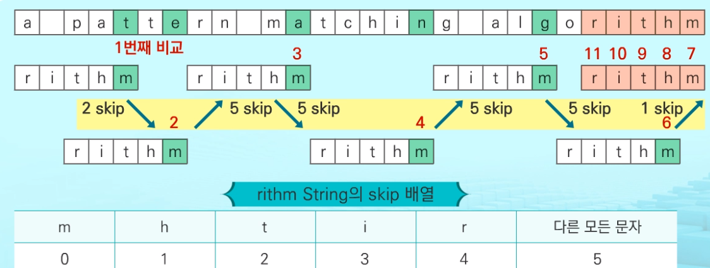

# 문자열(string)

### 유니코드 : 다국어 처리를 위한 표준


### 진수

`2진수` : 101 = 2^2X1 + 2^1X0 + 2^0X1 => `10진수`로 나타내면 4X1 +2X0 + 1X1 = 5

`10진수` : 153 = 100X1 + 10X5 +1X3 = 10^2X1 + 10^1X5 + 10^0X3

`16진수` : 0,1,2,3,4,5,6,7,8,9,A,B,C,D,3,F : 0x

```
0 000 0			8 1000  8		16 10000 10
1 001 1			9 1001  9
2 010 2			10 1010 A
3 011 3			11 1011 B
4 100 4			12 1100 C
5 101 5			13 1101 D
6 110 6			14 1110 E
7 111 7			15 1111 F
```


### 입력

```python
s = input()
print(s)
s = input().split()
print(s)
s = list(input())
print(s)
```

```
algorithm algorithm

['algorithm', 'algorithm']

['a', 'l', 'g', 'o', 'r', 'i', 't', 'h', 'm', ' ', 'a', 'l', 'g', 'o', 'r', 'i', 't', 'h', 'm']
```


### 문자열 뒤집기

```python
s = input()
print(s)
reverse_s = s[::-1]
print(reverse_s)
```

```
word
drow
```

```python
s = list(input())  # 'ABCD' => 'A', 'B', 'C', 'D'
print(s)

# 'A' <-> 'D', 'B' <-> 'D' :  총 교환 횟수는 글자수//2
for i in range(0,len(s)//2):  # 4//2 -> 2회, 인덱스 0,1
    s[i],s[len(s)-1-i] = s[len(s)-1-i],s[i]
print(s)  

for j in range(0, len(s)):   
    print(s[j], end="")

print(''.join(s))
```

```
algorithm
['m', 'h', 't', 'i', 'r', 'o', 'g', 'l', 'a']
mhtirogla
mhtirogla
```


### 두 문자열 비교

```python
# 문자열 자체를 비교
s1 = input()
s2 = input()

if s1 == s2:
    print(1)
else:
    print(0)
```

```python
# 인덱스를 이용해서 작업하는 연습
def f(s1,s2):
    i = 0  # 비교할 글자의 인덱스
    while(i < len(s1) and i < len(s2)):  # 어느 문자열의 끝이 아니고
        if s1[i] == s2[i]:
            i += 1
        else:
            break
    if i == len(s1) and i == len(s2):  # 마지막 글자까지 같고 동시에 종료(글자수 같음)
        return 1
    else:
        return 0
        
s1 = input()
s2 = input()    
print(f(s1,s2))
```

```
같으면 1
다르면 0
```


### 문자열 숫자를 정수로 변환(중요)

```python
def atoi(s):  # '123' -> 123 : '1' -> 1 -> 100
    n = 0
    for i in range(0, len(s)):
        n = n * 10 
        #n = n + int(s[i]) 
        n = n + ord(s[i]) - ord('0')
    return n

s = input()   # '123'
r = atoi(s)
print(r)
```

```
123
123
```


### 문자열 교체하기

복사해서 추가하기

```python
s1 = 'abc 1, 2, ABC'
s = ''
for i in range(0, len(s1)):
    if s1[i] == '1':
        s += 'one'
    elif s1[i] == '2':
        s += 'two'
    else:
        s += s1[i]
print(s)
```

```
abc one, two, ABC
```


## 패턴 매칭 알고리즘

- 고지식한 패턴 검색 알고리즘

- 카프-라빈 알고리즘

- KMP 알고리즘

- 보이어-무어 알고리즘

  

### 고지식한 알고리즘

- 텍스트의 모든 위치에서 패턴 비교하고 한칸씩 이동한다.
- 시간복잡도 O(MN)

```python
for i : 0 -> N-M  # 패턴의 길이만큼 비교구간을 만들었을때 시작 인덱스
	for j : 0 -> M-1  # 패턴 내부의 비교 위치
		if t[i+j] != p[j]
			break
	if 패턴의 끝까지 비교가 끝나면
    	return 1  # return i(패턴의 시작위치)
return -1  # 패턴이 존재하지 않음
```

```python
p = "is"  # 찾을 패턴
t = "This is a book~!"  # 전체 텍스트
M = len(p)  # 찾을 패턴의 길이
N = len(t)  # 전체 텍스트의 길이

def BruteForce(p, t):
    j = 0  # p의 인덱스
    i = 0  # t의 인덱스

    while j < M and i < N:
        if t[i] != p[j]:
            i = i - j     # 다음 시작점으로 이동
            j = -1        # 실패하면 원점으로 돌리기
        i = i + 1
        j = j + 1
    if j == M: 
        return i - M  # 검색성공
    else:
        return -1  # 검색실패
```


### KMP 알고리즘

- 불일치 발생한 앞부분에 대해 다시 비교하지 않고 매칭 수행
- next배열을 생성해 불일치 발생하면 이동할 다음 위치 저장
- 패턴의 왼쪽에서 오른쪽으로 비교
- 시간복잡도 O(M+N) = O(N)


### 보이어-무어 알고리즘

- 앞부분보다 끝부분가서 불일치 일어날 확률이 높다는 것 이용
- skip 배열 생성해서 일치하는 칸으로 몇 칸 이동해야하는지 저장
- 패턴의 오른쪽에서 왼쪽으로 비교
- 상용화된 제품이나 서비스에 가장 많이 적용됨
- 시간복잡도 일반적으로 O(N) 이하. 최학일땐 O(MN) 



```
1. pattern의 오른쪽 끝 문자와 text의 현재 위치의 문자가 일치하는지 검사
2. 끝이 일치하면 pattern과 text를 다 검사한다. 마지막까지 일치하지 않으면 패턴길이만큼 skip
3. 끝이 일치하지않으면 text의 현재위치 문자가 skip배열에 있는지 확인. 있으면 인덱스만큼 skip, 없으면 패턴길이만큼 skip
4. 텍스트 끝 도달할 때까지 반복 
```

```python
text = 'a pattern matching algorithm'   # 28
pattern = 'rithm'   # 5

s = pattern[::-1]   # mhtir
skip = list(range(len(pattern)))   # [0, 1, 2, 3, 4]

i = len(pattern) - 1  # 4
result = 0
while i < len(text):
    nxt = len(s)  # 패턴과 일치한 글자가 없으면 패턴길이만큼 점프
    j = 0
    if s[j] == text[i]:
        while j < len(s):
            if s[j] != text[i - j]:
                break
            j += 1
        if j == len(s):
            result = 1
    else:
        while j < len(s):
            if s[j] == text[i]:
                nxt = min(j, nxt)
                break
            j += 1
    if result:
        break
    i += nxt

print(result)
```

```python
for t in range(int(input())):
    pattern = input()
    text = input()
    pivot = len(pattern)-1
    skip_array = list(pattern)
    skip_array.reverse()
    result = 0
    while result != 1 and pivot < len(text):
        if pattern[len(pattern)-1] != text[pivot]:
            if text[pivot] in skip_array:
                nums = skip_array.index(text[pivot])
                pivot += nums
            else:
                pivot += len(pattern)
        else:
            for i, j in zip(range(pivot, pivot-len(pattern), -1), skip_array):
                if text[i] == j:
                    result = 1
                else:
                    result = 0
                    pivot = i
                    break
    print("#{} {}".format(t+1, result))
```


