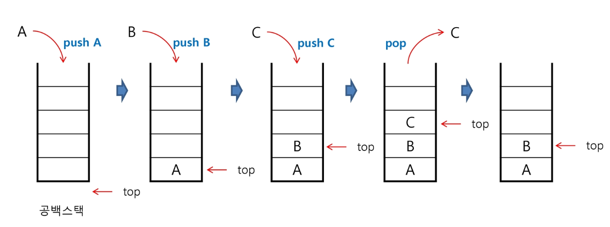
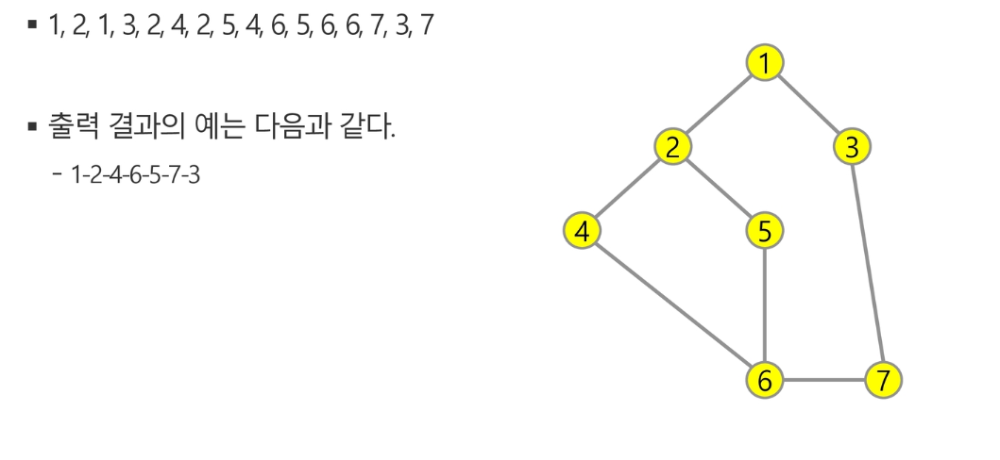
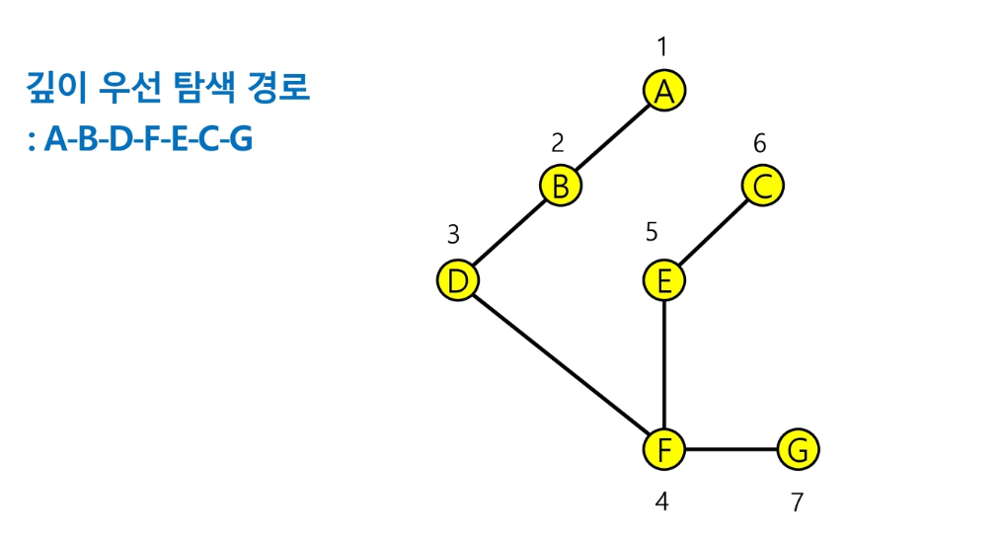

# 2019.08.19) 스택1

## 스택

- 물건을 쌓아 올리듯 자료를 쌓아 올린 형태의 자료구조
- 자료구조 : 마지막에 저장된(맨위) 자료를 꺼낸다.(후입선출 : `Last In First Out`)
- 스택에 저장된 자료는 `선형 구조`를 갖는다.(자료간의 관계가 1대1관계)(비선형은 1대N관계-ex.트리)
- 스택 포인터(top) : 마지막에 저장된 원소의 위치

- 1차원 배열은 스택의 크기를 변경하기 어렵다.(내부적으로 큰 overhead 발생, 시간 많이 걸림)
  - 리스트의 크기가 변동되지 않도록 배열처럼 크기를 미리 정해놓고 사용하는 방법
  - 동적 연결리스트를 이용하여 저장소를 동적으로 할당하여 스택을 구현하는 방법


### 스택 연산



`삽입(push)` : 저장

```python
def push(item):
    s.append(item)
```

`삭제(pop)`  : 자료를 꺼낸다.(삽입한 자료의 역순)

```python
def pop():
    if len(s) == 0:
        # underflow (없다.)
        return # 걍 돌아감
    else:
        return s.pop(-1)
```

`isEmpty` : 스택이 공백인지 아닌지 확인하는 연산

`peek` : 스택의 top에 있는 item(원소)를 반환


### 스택구현

```python
def push(item):
    s.append(item)
    
def pop():
    if len(s) == 0:
        print("stack is empty")   # underflow
        return
    else:
        return s.pop(-1)
s = []
push(1)
push(2)
push(3)
print("pop item =>", pop())
print("pop item =>", pop())
print("pop item =>", pop())
```

```python
# 크기가 정해진 리스트를 사용한 스택 구현
stack = [0]*10
top = -1

# push(1)
top = top + 1
stack[top] = 1
# push(2)
top = top + 1
stack[top] = 2
# push(3)
top = top + 1
stack[top] = 3

# pop()  : 실제로 값이 지워지진 않는다.
r = stack[top]
top = top - 1
print(r)

while top != -1:  # 스택이 비어있지 않으면 반복
    r = stack[top]
    top = top - 1
    print(r)
```

````
3  << pop()
2  << while
1
````


```python
# append()를 사용한 스택
s = list()

s.append(10)
s.append(20)
s.append(30)

while len(s) != 0:
    print(s.pop())
```


```
30
20
10
```


### 스택의 응용

#### 괄호의 짝을 검사하는 프로그램

```python
# 괄호의 짝이 맞으면 1 아니면 0 리턴
def f(txt):
    s = list()  # 스택 생성
    for i in range(len(txt)):
        if txt[i] == '(':     # 여는 괄호면 push()
            s.append(txt[i])
        elif txt[i] == ')':   # 닫는 괄호면 pop()
            if len(s) == 0:   # 스택이 비어있으면 오류
                return 0
            else:             # 스택이 비어있지 않으면 여는 괄호 하나 꺼냄
                s.pop()
    if len(s) != 0:     # 스택에 여는 괄호가 남아있으면
        return 0
    else:
        return 1

T = int(input())
for tc in range(1, T+1):
    txt = input()
    print(f(txt))
```

```
2
()()((()))
1
((()((((()()((()())((()))))))
0
```


#### 재귀호출

자기 자신을 호출하여 순환 수행되는 것

자기 자신을 호출하지만 사용하는 메모리 영역이 구분되므로 다른 함수를 호출하는 것과 같음

디버깅이 어려움, 시간 김(중복호출), 메모리 불안정 문제가 있다. 하지만 알고리즘문제를 풀 때는 효과적이다.

```python
# factorial
def fact(n):
    if n < 2:
        return 1
    else:
        return n * fact(n-1)

N = 4
print(fact(N))
>>24
```

```python
# 피보나치
def fibo(n):
    if n < 2:
        return n
    else:
        return fibo(n-2) + fibo(n-1)

N = 4
print(fibo(N))
>>3
```

피보나치 수를 구하는 함수를 재귀함수로 구현한 알고리즘은 `엄청난 중복 호출`이 존재하는 문제점이 있다. 이를 해결하기 위해서 메모이제이션을 사용한다.


## 메모이제이션(MEMOIZATION) 

이전에 계산한 값을 메모리에 저장해서 매번 다시 계산하지 않아서 실행속도를 빠르게 하는 기술(리스트에 저장)(DP동적 계획법의 핵심이 되는 기술)

최적화 문제를 해결하는 알고리즘

```PYTHON
# memo를 위한 배열을 할당하고, 모두 0으로 초기화
# mem[0]을 0으로 memo[1]는 1로 초기화 한다.
# 기존에 계산하여 저장된 값이 있을 경우에 다시 계산하지 않음

def fibol(n):
    global memo
    if n >=2 and len(memo) <= n:
        memo.append(fibol(n-1) + fibol(n-2))
    return memo[n]

memo = [0, 1]
```

```python
def fibo(n):
    global memo
    if n >= 2 and memo[n] == 0:    # 아직 fibo(n)이 계산되지 않은 경우
        memo[n] = fibo(n-1) + fibo(n-2)
    return memo[n]    # fibo(n)이 계산되어 있으면 리턴

N = 7
memo = [0]*(N+1)
memo[0] = 0
memo[1] = 1
print(fibo(N))
```

```
13
```


## DP(동적 계획법)(x)

최적화 문제를 해결하는 알고리즘

재귀함수의 피보나치는 위에서 아래로 내려간다면 DP는 아래에서 위로 올라가서 해결한다.

모든 문제를 해결할 순 없다.  식을 구해서 식을 검증하기에 좋은 방식

먼저 입력 크기가 작은 부분 문제들을 모두 해결한 후에 그 해들을 이용하여 보다 큰 크기의 부분 문제들을 해결, 최종적으로 원래 주어진 입력의 문제를 해결한다.

```
피보나치DP
1. 문제를 부분 문제로 분할한다.
2. 부분 문제로 나누는 일을 끝냈으면 가장 작은 부분 문제부터 해를 구한다.
3. 그 결과는 테이블에 저장하고, 테이블에 저장된 부분 문제의 해를 이용하여 상위 문제의 해를 구한다.
```

```PYTHON
def fibo2(n):
    f = [0, 1]
    
    for i in range(2, n+1):
        f.append(f[i-1] + f[i-2])
    return f[n]
```

### DP의 구현방식

```
recursive방식: fibo1()
재귀적 구조
내부에 시스템 호출 스택을 사용하는 overhead가 발생할 수 있음
```

```
iterative방식: fibo2()
반복적 구조
memoization을 재귀적 구조에 사용하는 것보다 반복적 구조로 DP를 구현하는 것이 성능면에서 보다 효율적이다.
```


## 비선형 구조

비선형구조인 그래프구조는 그래프로 표현된 모든 자료를 빠짐없이 검색하는 것이 중요하다.

1. 깊이 우선 탐색(Depth First Search, DFS)
2. 너비 우선 탐색(Breadth First Search, BFS)

```python
def DFS(graph, start_node):
    visit = []
    stack = []
    stack.append(start_node)

    while stack:
        node = stack.pop()
        if node not in visit:
            visit.append(node)
            stack.extend(graph[node])

    return visit


def BFS(graph, start_node):
    visit = []
    queue = []
    queue.append(start_node)

    while queue:
        node = queue.pop(0)
        if node not in visit:
            visit.append(node)
            queue.extend(graph[node])
            # queue += graph[node] - set(visited)

    return visit
```

```python
# 두 노드 간 경로 탐색 bfs
def bfs_paths(graph, start, goal):
    queue = [(start, [start])]
    result = []

    while queue:
        n, path = queue.pop(0)
        if n == goal:
            result.append(path)
        else:
            for m in graph[n] - set(path):
                queue.append((m, path + [m]))
    return result
```


### DFS(깊이우선탐색) - STACT이용

시작 정점의 한 방향으로 갈 수 있는 경로가 있는 곳까지 깊이 탐색해 가다가 

더 이상 갈 곳이 없게 되면, 마지막에 만났던 갈림길 간선이 있는 정점으로 되돌아와서 

다른 방향의 정점으로 탐색을 계속 반복하여 결국 모든 정점을 방문하는 순회방법

가장 마지막에 만났던 갈림길의 정점으로 되돌아가서 다시 깊이 우선 탐색을 반복해야 하므로 `후입선출 구조의 스택 사용`

### DFS 알고리즘

1. 시작 정점 v를 결정하여 방문한다.

2. 정점 v에 인접한 정점 중에서

   1. 방문하지 않은 정점 w가 있으면, 

      정점 v를 스택에 push하고 정점 w를 방문한다. 그리고 w를 v로 하여 다시 2.를 반복한다.

   2. 방문하지 않은 정점이 없으면, 

      탐색의 방향을 바꾸기 위해 스택을 pop하여 받은 가장 마지막 방문 정점을 v로 하여 다시 2.를 반복한다.

3. 스택이 공백이 될 때까지 2.를 반복한다.

```python
def dfs(graph, start):
    visited = []
    stack = [start]

    while stack:
        node = stack.pop()
        if node not in visited:
            visited.append(node)
            stack += graph[n] - set(visited)
            # stack.extend(graph[node])
    return visited
```

```python
# 두 노드 간 경로 탐색(재귀)
def dfs_paths(graph, start, goal):
    stack = [(start, [start])]
    result = []

    while stack:
        n, path = stack.pop()
        if n == goal:
            result.append(path)
        else:
            for m in graph[n] - set(path):
                stack.append((m, path + [m]))
    return result
```




```
입력
7 8 
1 2 1 3 2 4 2 5 4 6 5 6 6 7 3 7
```

```python
# 그래프
def dfs(n, V):
    print(n)  # 방문 노드 출력
    visited[n] = 1   # n번 노드에 방문 표시

    for i in range(1, V+1):  # 모든 노드 i에 대해
        if adj[n][i] == 1 and visited[i] == 0:  # 인접하고 미방문이면
            dfs(i, V)  # i로 이동


V, E = map(int, input().split())
adj = [[0]*(V+1) for _ in range(V+1)]   # 1. 인접행렬 만들기
edge = list(map(int, input().split()))
visited = [0]*(V+1)   #  방문 표시용

for i in range(E):
    n1, n2 = edge[i*2], edge[i*2+1]
    adj[n1][n2] = 1
    adj[n2][n1] = 1  # n1에서 n2로 가는 방향성 그래프인 경우 필요없음
    
dfs(1, V)
```

```python
# 4에서 3으로 가는 경로 찾기

def dfs(n, V):
    print(n)  # 방문 노드 출력
    visited[n] = 1   # n번 노드에 방문 표시

    for i in range(1, V+1):  # 모든 노드 i에 대해
        if adj[n][i] == 1 and visited[i] == 0:  # 인접하고 미방문이면
            dfs(i, V)  # i로 이동


V, E = map(int, input().split())
adj = [[0]*(V+1) for _ in range(V+1)]   # 1. 인접행렬 만들기
edge = list(map(int, input().split()))
visited = [0]*(V+1)   #  방문 표시용

for i in range(E):
    n1, n2 = edge[i*2], edge[i*2+1]
    adj[n1][n2] = 1
    #adj[n2][n1] = 1

for i in range(V):
    for j in range(V):
        print(adj[i][j], end=" ")
    print()

dfs(4, V)
print(visited)
```

```python
def dfs(n, V):
    print(n)  # 방문 노드 출력
    visited[n] = 1   # n번 노드에 방문 표시

    for i in range(1, V+1):  # 모든 노드 i에 대해
        if adj[n][i] == 1 and visited[i] == 0:  # 인접하고 미방문이면
            dfs(i, V)  # i로 이동

def dfs2(n, k, V):  # 찾는 노드에 도착하면 탐색 중지
    if n == k:  # 찾는 노드에 도착한 경우
        return 1  # 목적지를 찾아서 중단하는 경우
    else:
        visited[n] = 1   # n번 노드에 방문 표시
        for i in range(1, V+1):  # 모든 노드 i에 대해
            if adj[n][i] == 1 and visited[i] == 0:  # 인접하고 미방문이면
                if dfs2(i, k, V) == 1:  # i로 이동, 목적지를 찾은 경우
                    return 1
        return 0  # 현재 노드 이후로 목적지가 없는 경우

V, E = map(int, input().split())
adj = [[0]*(V+1) for _ in range(V+1)]   # 1. 인접행렬 만들기
edge = list(map(int, input().split()))
visited = [0]*(V+1)   #  방문 표시용

for i in range(E):
    n1, n2 = edge[i*2], edge[i*2+1]
    adj[n1][n2] = 1
    #adj[n2][n1] = 1

# dfs(0, V)
result = dfs2(1, 7, V)   # 찾는 노드 k에 도착하면 탐색 중지
#print(visited)
print(result)
```




경로중 오름차순으로 탐색

탐색구간의 다음 경로에 안가본 구간이 있으면 PUSH한다. 

경로가 없으면 뒤돌아가서 안가본 구간이 있는 곳까지 POP한다.