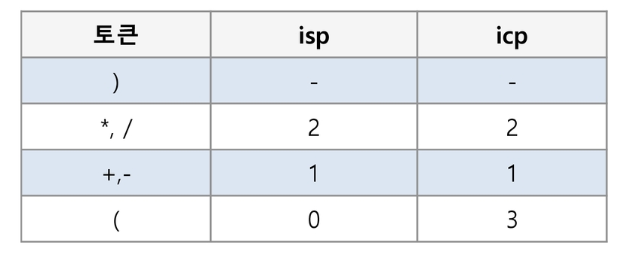
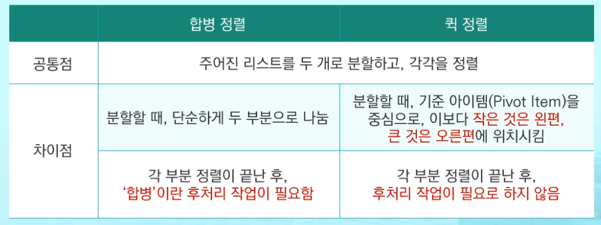

# 2019.08.20) APS - 6. 스택2

## 1. 계산기

문자열로 된 계산식이 주어질 때, `스택`을 이용하여 이 계산식의 값을 계산할 수 있다.

문자열 수식 계싼의 일반적 방법

- step1. 중위 표기법의 수식을 후위 표기법으로 변경(스택 이용)

- step2. 후위 표기법의 수식을 스택을 이용하여 계산한다.

  (중위표기법 : 연산자를 피연산자의 가운데 표기하는 방법)

  (후위표기법 : 연산자를 피연산자 뒤에 표기하는 방법)



#### A*B-C/D

```
((A*B)-(C/D))

((AB)*(CD)/)-

AB*CD/-
```

#### (6+5*(2-8)/2) [중위표기법]

```
6528-*2/+ : 후위표기법
```


#### 6528-*2/+ [후위표기법] 

```
-9
```


## 2. 백트래킹

해를 찾는 도중에 막히면(해X) 되돌아가서 다시 해를 찾아 가는 기법

최적화문제와 결정 문제(이러한 조건을 만족하는 해가 존재하는지)를 해결

깊이우선탐색(모든 경로를 추적)과의 차이는 어떤 노드에서 출발하는 경로가 해결책으로 이어질 것 같지 않으면 더 이상 그 경로를 따라가지 않음으로써 시도의 횟수를 줄인다.

### Queen

```PYTHON
# A형 준비하는사람 QUEEN(체스)풀줄알아야함
def checknode(v):
    if promising(v):
        if there is a solution at v:
            write the solution
        else:
            for u in each child of v:
                checknode(u)
```

nxn체스판에 queen을 놓을 수 있는 가지수는?

queen은 같은 행, 열, 대각선에 둘 수 없다.


### 미로찾기

```python
# 반복문(스택이용)
def find(sRow, sCol):
    dRow = [0, 1, 0, -1]
    dCol = [1, 0, -1, 0]
    s = []
    s.append([sRow,sCol])    # 입구로 이동
    maze[sRow][sCol] = 1     # 방문 표시
    while len(s) != 0:
        n = s.pop()          # 이동할 칸 좌표를 꺼내고(이동할 수 없을때 뒤로 이동)
        for i in range(4):    # 주변 좌표 계산
            nRow = n[0] + dRow[i]
            nCol = n[1] + dCol[i]
            if nRow >=0 and nRow<N and nCol>=0 and nCol <N:  # 미로 내부인지 확인
                if maze[nRow][nCol] == '3':     # 목적지인 경우 1반환
                    return 1
                elif maze[nRow][nCol] == '0':    # 갈 수 있는 곳 저장
                    s.append([nRow, nCol])
                    maze[n[0]][n[1]] = 1
    return 0    # 출구에 가지 못하고 모든칸 방문

T = int(input())
for tc in range(1, T+1):
    N = int(input())
    maze = [list(input()) for _ in range(N)]

    startI = 0
    startJ = 0
    for i in range(N):
        for j in range(N):
            if maze[i][j] == '2':
                startI = i
                startJ = j
    print('#{} {}' .format(tc, find(startI, startJ)))
```

```python
# 재귀를 이용한 미로찾기
def f(i, j):
    di = [0, 1, 0, -1]
    dj = [1, 0, -1, 0]
    global maze
    global N
    # if maze[i][j] == '1':   # 벽이면
    #     return 0
    if maze[i][j] == '3':   # 목적지면
        return 1
    else:
        maze[i][j] = '1'   # 방문 표시, 벽으로 바꿈
        # 이동할 좌표 생성
        for k in range(4):
            ni = i + di[k]
            nj = j + dj[k]
            if ni>=0 and ni<N and nj>=0 and nj<N:
                if maze[ni][nj] != '1':  # 벽이 아니면 방문 (0,3)
                    if f(ni, nj) == 1:  # 진행방향에서 목적지를 찾은 경우
                        return 1
        return 0  # 현재위치에서 갈 수 있는 방햐에서 목적지를 찾지 못함. 이전의 다른 방향 탐색


T = int(input())
for tc in range(1, T+1):
    N = int(input())
    maze = [list(input()) for _ in range(N)]

    # 시작점 찾기
    startI = 0
    startJ = 0
    for i in range(N):
        for j in range(N):
            if maze[i][j] == '2':
                startI = i
                startJ = j
    print('#{} {}' .format(tc, f(startI, startJ)))
```


### 부분집합

{1,2,3,4,5,6,7,8,9,10}의 powerset 중 원소의 합이 10인 부분집합을 구하시오.

```python
# 합이 10인 부분집합의 개수
N = 10
cnt = 0
arr = [i for i in range(1, N+1)]
for i in range(1, 1<<N):
    s = 0
    for j in range(N):  # 0에서 9번 비트까지 검사
        if i & (1<<j):
            s += arr[j]  # j번이 부분집합에 포함되면
            # s += j+1   # 인덱스를 직접 부분집합의 숫자로 활용
    if s == N:
        cnt += 1
print(cnt) >> 10
```

```PYTHON
# 부분집합이 20개고 합이 10인 부분집합의 개수 (시간이 오래걸린다.)
N = 20
K = 10
cnt = 0
arr = [i for i in range(1, N+1)]
for i in range(1, 1<<N):
    s = 0
    for j in range(N):  # 0에서 9번 비트까지 검사
        if i & (1<<j):
            s += arr[j]  # j번이 부분집합에 포함되면
            # s += j+1   # 인덱스를 직접 부분집합의 숫자로 활용
    if s == K:
        cnt += 1
print(cnt) >> 10
```

```PYTHON
# 부분집합이 N개고 합이 K인 부분집합의 개수(재귀)
def f(i, N, K):   # i는 0인지 1인지 결정
    global cnt
    global bit
    
    if i == N:  # bit의 모든칸이 결정됨
        s = 0
        for j in range(N):   # 0~N-1은 원 집합의 원소 1~N을 가리킴
            if bit[j] == 1:  # j+1이 부분집합에 포함된 경우
                s += j+1
        if s == K:
            cnt += 1
    else:
        bit[i] = 0
        f(i+1, N, K)
        bit[i] = 1
        f(i + 1, N, K)


N = 10   # 1부터 N까지 집합의 원소
K = 10   # 부분집합의 합
cnt = 0  # 개수
bit = [0]*N
f(0, N, K)
print(cnt)
```

```python
# 부분집합이 N개고 합이 K인 부분집합의 개수(재귀)(백트래킹)
def f(i, N, K, s, r):   # i는 0인지 1인지 결정
    global cnt
    global bit
    global cnt2
    cnt2 += 1  # 모든경우를 다 돌리는 경우 횟수
    if s == K:  # 나머지 원소를 하나라도 추가하면 K보다 커지므로 # 내가 찾는 합에 도달했으면(뒤에 나머지를 포함시킬필요 x)
       cnt += 1
       return
    elif i == N:  # 모든 원소를 고려했지만 합이 K가 아닌경우
       return
    elif s>K:
        return
    elif s+r<K:  # 남은 모든 원소를 포함해도 K보다 작은경우
        return
    # if i == N:   # 모든단계를 다 도는 경우(재귀호출 횟수비교)
    #     if s == K:
    #         cnt += 1
    else:
        # 합이 변하지 않은채로 넘어감
        f(i+1, N, K, s, r -(i+1))  # i번이 가리키는 값은 부분집합에 포함하지 않음

        f(i+1, N, K, s + i+1,  r -(i+1))  # i번이 가리키는 값을 부분집합에 포함


N = 20   # 1부터 N까지 집합의 원소
K = 10   # 부분집합의 합
cnt = 0  # 개수
cnt2 = 0
bit = [0]*N
f(0, N, K, 0, (1+N)*N//2)
print(cnt)
print(cnt2)
```


## 3. 분할 정복

- 분할 : 해결할 문제를 여러 개의 작은 부분으로 나눈다.
- 정복 : 나눈 작은 문제를 각각 해결한다.
- 통합 : (필요하다면) 해결된 해답을 모은다.

### 거듭제곱 : O(n)

```python
def Power(base, exponent):
    if Base == 0:
        return 1    # Base^0
    for i in range(Exponenet):
        result *= Base
    return result
```

### 분할 정복 : O(log2n)

부분부분으로 나눠서 구한다. (전체를 한 번에 구하는게 아님)

```python
def Power(Base, Exponent):
    if Exponent == 0 or Base == 0:
        return 1
    if Exponent % 2 == 0:
        NewBas = Power(Base, Exponent/2)
        return NewBase * NewBase
    else:
        NewBase = Power(Base, (Exponent-1)/2)
        return (NewBase * NewBase) * Base
```

짝수(n/2), 홀수((n-1)/2)로 나눠서 


### 퀵 정렬



```python
# 퀵정렬 알고리즘
def quicksort(a, begin, end):
    if begin < end:
        p = partition(a, being, end)
        quicksort(a, begin, p-1)   # 피봇보다 작은부분 정렬
        quicksort(a, p+1, end)     # 피봇보다 큰 부분 정렬
```

```python
# 피봇 구하는 알고리즘
def partition(a, being, end):
    pivot = (begin + end)//2
    L = begin
    R = end
    while L < R:
        while a[L] < a[pivot] and L < R:
            L += 1
        while a[R] >= a[pivot] and L< R:
            R -= 1
        if L < R:
            if L == pivot:
                pivot = R
                a[L], a[R] = a[R], a[L]
   	a[pivot], a[R] = a[R], a[pivot]
    return R
```

퀵 정렬(b형 준비하는사람 반드시 코드 짜기)

기준 아이템 중심(피봇)으로 작으면 왼쪽, 크면 오른쪽으로 위치시킨다.(파티션)

왼쪽 구간에 대해서 퀵소트

오른쪽 구간에 대해서 퀵소트

반복

모든 아이템이 피봇이 되어 정렬이된다.

