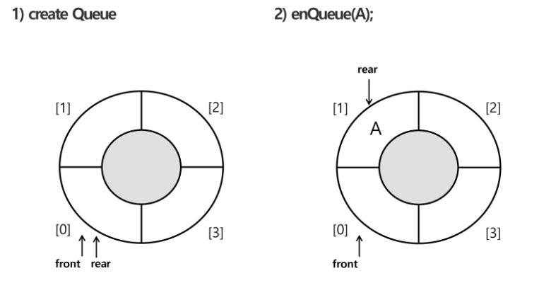
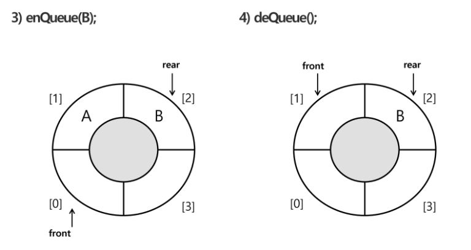

# 2019.08.21) APS - 7. 큐(Queue)

## 큐

삽입과 삭제의 위치가 제한적인 자료구조

ex) 선입선출구조 : First in First out : 삭제(머리 front), 삽입(꼬리 rear)

두 개의 index를 사용한다. : 삽입(enQueue), 삭제(deQueue)


### 큐의 연산


createQueue() : `공백 큐 생성` : front = rear = -1 (초기값)

enQueue() : `삽입` : rear +1 (마지막으로 저장된 위치)

```python
def enQueue(item):
    global rear
    if isFull() : 
        print("Queue_Full")     
    else:
        rear += 1
        Q[rear] = item
```

deQueue() : `삭제` : front+ 1

front와 rear값이 같으면 큐가 비어있다.

```python
q = [0]*10   # 10칸짜리 큐 생성
front = -1
rear = -1


rear += 1
q[rear] = 1  # enqueue(1)

rear += 1
q[rear] = 2  # enqueue(2)

rear += 1
q[rear] = 3  # enqueue(3)


while front != rear:   # q is not empty()
    front += 1
    print(q[front])   # 꺼내기
```

```
1
2
3
```


## Queue의 종류

- 선형큐 : 가장 기본적인 형태(리스트 사용)
- 원형큐 : 선형에서 발전된 형태(리스트 사용)
- 연결큐 : 연결 리스트 형식을 이용
- 우선순위 큐

선형 큐의 문제점

원형 큐 이용하기


### 선형 큐

- 1차원 리스트를 이용한 큐

  ```
  큐의 크기 = 리스트의 크기
  front : 저장된 첫 번째 원소의 인덱스
  rear : 저장된 마지막 원소의 인덱스
  ```

- 상태표현

  ```
  초기상태 : front = rear = -1
  공백상태 : front = rear
  포화상태 : rear = n-1 (n:리스트의 크기, n-1:리스트의 마지막 인덱스)
  ```

- ```python
  def enQueue(item):
      global rear
      if isFull():
          print("Queue_Full")
      else:
          rear += 1
          Q[rear] = item
          
  def deQueue():
      glbal front
      if isEmpty():
          print("Queue_Empty")
      else:
          front += 1
          return Q[front]
  
  def isEmpty():
      return front == rear
  
  def isFull():
      return rear == len(Q) - 1
  
  def Qpeek():   # 검색: 가장 앞의 원소
      if isEmpty():
          print("Queue_Empty")
      else:
          return Q[front+1]
  ```

- 문제점

  리스트의 크기를 고정하기 때문에 사용할 큐의 크기만큼을 미리 확보해서 `메모리의 낭비`가 발생한다.  => 해결 방법 : 원형 큐 사용으로 메모리 절약, 파이썬 리스트는 동적 할당됨 등등등

  삽입, 삭제를 계속할 경우 리스트의 앞부분에 활용할 수 있는 공간이 있음에도, rear=n-1인 상태 즉, 포화 상태로 인식하여 더 이상의 삽입을 수행할 수 없다.


### 원형큐

초기 공백 상태 : front = rear = 0

삽입 위치 : rear = (rear + 1) % n

삭제 위치 : front = (front + 1) % n

front 변수는 비워두고 쓴다. (공백 상태와 포화 상태 구분을 쉽게 하기 위해서)





```python
def isEmpty():
    return front == rear

def isFull():
    return (rear+1) % len(cQ) == front

def enQueue(item):
    global rear
    if isFull():
        print("Queue_Full")
    else:
        rear = (rear + 1) % len(cQ)
        cQ[rear] = item
        
def deQueue():
    global front
    if isEmpty():
        print("Queue_Empty")
    else:
        front = (front + 1) % len(cQ)
        return cQ[front]
    
cQ_size = 3
cQ = [0]*cQ_size
front = rear = 0  # 초기화
enQueue('A')
enQueue('B')
enQueue('C')
print(deQueue())
print(deQueue())
print(deQueue())
```


### 파이썬으로 구현한 원형 큐의 삽입 및 삭제 함수

```python
def enQueue(item):
    queue.append(item)
        
def deQueue():
    if isEmpty():
        print("Queue_Empty")
    else:
        return queue.pop(0)
    
def isEmpty():
    return len(queue) == 0

def Qpeek():
    if isEmpty():
        print("Queue_Empty")
    else:
        return queue[0]
    
queue = []
# front :-1   rear = len(queue) - 1 
enQueue('A')
enQueue('B')
enQueue('C')
print(deQueue())
print(deQueue())
print(deQueue())
```


### 연결 큐


## 큐의 활용

### 우선순위 큐

우선순위를 가진 항목들을 저장하는 큐(우선순위가 높은 순서대로)


### 버퍼

데이터를 한 곳에서 다른 한 곳으로 전송하는 동안 일시적으로 그 데이터를 보관하는 메모리의 영역

마이쮸


## BFS(너비 우선 탐색)

그래프 탐색 방법은 DFS, BFS가 있다.

탐색 시작점의 인접한 정점들을 먼저 모두 차례로 방문한 후에, 방문했던 정점을 시작점으로 하여 다시 인접한 정점들을 차례로 방문하는 방식


같은 거리부터 검사(거리순 탐색)


```PYTHON
def BFS(G, v):  // 그래프 G, 탐색 시작점v
	visited = [0]*n   # n:정점의 개수
   	queue = []   # 큐 생성
    queue.append(v)  # 시작점 v를 큐에 삽입
   
    while queue:  # 큐가 비어있지 않는 경우
    	t = queue.pop(0)  # 큐의 첫 번째 원소 반환
        if not visited[t]:  # 방문하지 않은 곳이라면
            visited[t] = True  # 방문한 것으로 표시
            visit(t)
        for i in G[t]:  # t와 연결된 모든 선에 대해
            if not visited[i]:  # 방문되지 않은 곳이라면
                queue.append(i)  # 큐에 넣기
```

```PYTHON
q = [0]*9  # 탐색할 대상의 개수만큼 큐 생성
front = -1
rear = -1

rear += 1    # enq(1)  시작점 인큐
q[rear] = 1   # enq(1)
visited[1] = 1   # 시작점 방문 표시

while front != rear:   # 큐가 비어있지 않으면
    front += 1
    t = q[front]   # 디큐
    # t에 인접이고 방문하지 않은 정점이면
    # 주어진 상황에 맞게 완성...
    # t 주변의 모든 i에 대해
    	if visited[i] == 0 and t에 i가 인접:
            .... # enq(i)
            visited[i] = visited[t] + 1  # 그룹화
```

출발지가 한곳에서 시작한건 bfs 내가 필요한 부분만 검색

출발지가 여러개 있고 각각 다 돌려야하는건 dfs -> 출발지를 다 넣어준다. 전부다 검색


