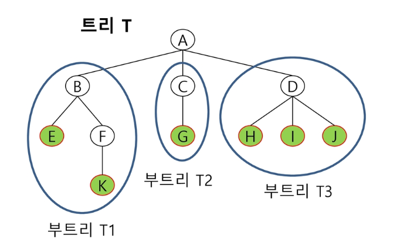
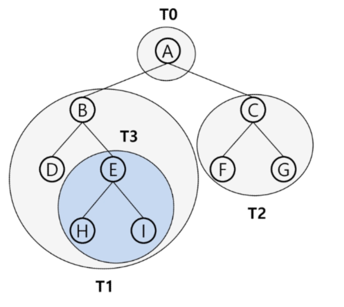
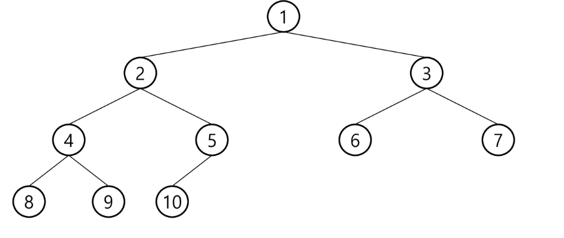

# 2019.09.09) APS - 9. 트리

## 개념

비선형 구조로 원소들 간에 계층관계를 가지는 계층형 자료구조

원소들 간에 1:n 관계를 가지는 자료구조

T1....TN은 각각 하나의 트리가 되며(재귀적 정의) 루트의 부 트리(subtree)라 한다.




## 용어

노드(node) : 트리의 원소(A, B, C, D, E, F, G, H, I, J, K)

간선(edge) : 노드를 연결하는 선, 부모 노드와 자식 노드를 연결


루트 노드(root node) : 트리의 시작 노드(A)

형제 노드(sibling node) : 같은 부모 노드의 자식 노드들(B, C, D)

조상 노드 : 간선을 따라 루트 노드까지 이르는 경로에 있는 모든 노드들

서브 트리(subtree) : 부모 노드와 연결된 간선을 끊었을 때 생성되는 트리

자손 노드 : 서브 트리에 있는 하위 레벨의 노드들


차수

	- 노드의 차수 : 노드에 연결된 자식 노드 수
	- 트리의 차수 : 트리에 있는 노드의 차수 중에서 가장 큰 값
	- 단말 노드(리프 노드) : 차수가 0인 노드, 자식 노드가 없는 노드

높이

	- 노드의 높이 : 루트에서 노드에 이르는 간선의 수. 노드의 레벨
	- 트리의 높이 : 트리에 있는 노드의 높이 중에서 가장 큰 값. 최대 레벨


## 이진트리 

모든 노드들이 2개 이하의 서브트리를 갖는 형태의 트리

레벨i에서 노드의 최대 개수 : 2^i

높이가 h인 이진 트리의 노드의 최소 개수는(h+1)개, 최대 개수는(2^(h+1)-1)개

#### 이진트리 정보

```python
5 4   # 노드의 개수 V, 간선의 개수 E
2 1 2 4 4 3 4 5  # 부모, 자식
```

#### 저장 방법

```python
# 부모를 인덱스로 자식번호를 저장
for i in range(1, N):
    read p, c
    if ch[p] == 0:
        ch1[p] = c
    else:
        ch2[p] = c
```

```python
# 자식 번호를 인덱스로 부모 번호를 저장
for i in range(1, N):
    read p, c
    pa[c] = p
```

#### 루트 찾기

```python
1. 루트 찾기(부모가 없는 노드 찾기)

2. 조상 노드 찾기
c = 5
while a[c] != 0:  # 루트인지 확인
    c = a[c]
    print(c)
```


## 순회 : 트리의 노드를 중복없이 방문



#### 전위순회 : 부모노드 방문 후, 자식 노드를 좌, 우 순서로 방문

```
순서1 : T0 -> T1 -> T2
순서2 : A -> B D (T3) -> C F G
총 순서 : A B D E H I C F G
```

#### 중위순회 : 왼쪽 자식노드, 부모노드, 오른쪽 자식 노드 순으로 방문

```
순서1 : T1 -> T0 -> T2
순서2 : D B (T3) -> A -> F C G
총 순서 : D B H E I A F C G
```

#### 후위순회 : 자식노드를 좌우 순서로 방문한 후, 부모노드로 방문

```
순서1 : T1 -> T2 -> T0
순서2 : B D (T3) -> C F G -> A
총 순서 : D H I E B F G C A
```


```
13
1 2 1 3 2 4 3 5 3 6 4 7 5 8 5 9 6 10 6 11 7 12 11 13
```

```python
def preorder(n):
    if n>0:
        print(n, end=" ")
        preorder(ch1[n])
        preorder(ch2[n])

def inorder(n):
    if n>0:
        inorder(ch1[n])
        print(n, end=" ")
        inorder(ch2[n])

def postorder(n):
    if n>0:
        postorder(ch1[n])
        postorder(ch2[n])
        print(n, end=" ")

def f(n):   # n의 조상 출력하기
    while par[n] != 0:     # n의 부모가 있으면
        print(par[n], end=" ")
        n = par[n]        # 부모를 새로운 자식으로 해서 부모의 부모를 찾으러 감


V = int(input())   # 간선 수 = V - 1
E = V - 1   # 간선 수
t = list(map(int, input().split()))

ch1 = [0] * (V+1)   # 부모를 인덱스로 자식 저장
ch2 = [0] * (V+1)
par = [0] * (V+1)   # 자식을 인덱스로 부모 저장

for i in range(E):  # 간선의 개수만큼
    p = t[2*i]
    c = t[2*i + 1]
    if  ch1[p] == 0:  # 아직 ch1 자식이 없으면
        ch1[p] = c
    else:
        ch2[p] = c
    par[c] = p


preorder(1)
print()
inorder(1)
print()
postorder(1)
print()
f(13)
```

```
[0, 2, 4, 5, 7, 8, 10, 12, 0, 0, 0, 13, 0, 0]
[0, 3, 0, 6, 0, 9, 11, 0, 0, 0, 0, 0, 0, 0]
[0, 0, 1, 1, 2, 3, 3, 4, 5, 5, 6, 6, 7, 11]
1 2 4 7 12 3 5 8 9 6 10 11 13 
12 7 4 2 1 8 5 9 3 10 6 13 11 
12 7 4 2 8 9 5 10 13 11 6 3 1 
11 6 3 1
```


#### 이진 트리 순회

```python
# 재귀 : 존재한지 검사한 후 들어감
DLR(1):
    Visite()
    if Left:
        DLR()
    if Right:
        DLR()
```

```PYTHON
# 들어간뒤 검사
F(1)
	if():
        V(1)
        f()
        f()
```

#### ex

```python
# 1번 노드부터 이진트리를 순회하고 방문한 노드의 개수를 출력
f(1)
	if(1)
    	cnt += 1
        f(2)
        f(3)
```


## 이진트리 - 종류

### 1. 포화 이진 트리

모든 노드가 다 차있는 상태

노드 번호에 규칙성이 있다.(노드에 번호가 적혀있다.)

높이가 h일 때, 최대의 노드 개수인(2^(h+1)-1)의 노드를 가진다.


### 2. 완전 이진 트리

마지막레벨의 오른쪽 끝에서 순서대로 빠져있다.




### 3. 편향 이진 트리 

트리가 한쪽으로 치우쳐지는 현상으로 사용하지 않는 리스트 원소에 대한 메모리 공간 낭비가 발생한다. (레드? : 차수를 낮춰준다.)(연결 리스트를 이용)

높이 h에 대한 최소 개수의 노드를 가지면서 한쪽 방향의 자식 노드만을 가진다.


## 트리의 표현 

### 리스트를 이용한 이진 트리의 표현

이 그림은 완전이진트리의 그림이다.

[자식노드//2] =  부모 노드

부모 노드 번호[i/2], 왼쪽 자식 노드 번호[2xi], 오른쪽 자식 노드 번호[2xi+1]

레벨 n의 최대 노드 수 : [2^n], 리스트 크기 : [2^(h+1)+1] 


### 트리의 표현 - 연결리스트

이진 트리의 표현의 단점을 보완하기 위해 연결 리스트를 이용하여 트리를 표현

왼쪽 자식 노드, 데이터, 오른쪽 자식 노드

메모리를 효율적으로 사용할 수 있지만, 속도가 오래걸린다.


정점의 개수 = 엣지?의 개수 + 1


수식트리


## 이진 탐색 트리

탐색 작업을 효율적으로 하기 위한 자료구조

모든 원소는 서로 다른 유일한 키를 가진다.

key(왼쪽 서브트리) < key(루트 노드) < key(오른쪽 서브트리)


### 이진 탐색


### 삽입 연산

이진 탐색이 실패한 곳이 삽입할  장소


인접행렬(간선의 방향x)

그래프 저장

```python
read V,E
for i in range(1, E):
    read n1, n2
    M[n1][n2] = 1
    M[n2][n1] = 1
```


## 힙(heap)

`완전 이진트리`에 있는 노드 중에서 키 값이 가장 큰 노드나 키값이 가장 작은 노드를 찾기 위한 자료구조

최대 힙 : 부모가 항상 커야함, 키 값이 가장 큰 노드를 찾기 위한 완전 이진 트리(루트 노드)

최소 힙 : 자식이 항상 커야함, 키 값이 가장 작은 노드를 찾기 위한 완전 이진 트리(루트 노드)


### 삽입

비어 있는 곳에 임시로 삽입

부모 노드와 위치 바꾸기(루트까지)


### 삭제

완전 이진트리를 유지해야한다.(마지막 노드를 지워야함)

자식이 두명이면 큰 아이를 선택(자식을 비교), 자식이 없는 노드를 선택해서 루트로 복사한 후 지운다. 

자식노드가 더 크다면 자리를 바꿔준다.


루트 노드의 원소를 삭제

마지막 노드를 루트 노드 위치로 이동

삽입노드와 자식노드를 비교하여 자리 바꾸기