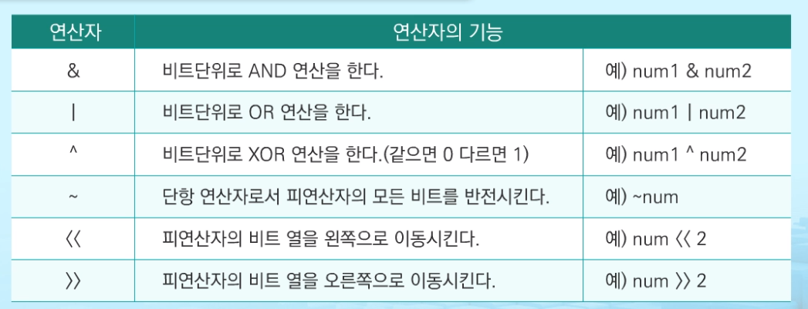
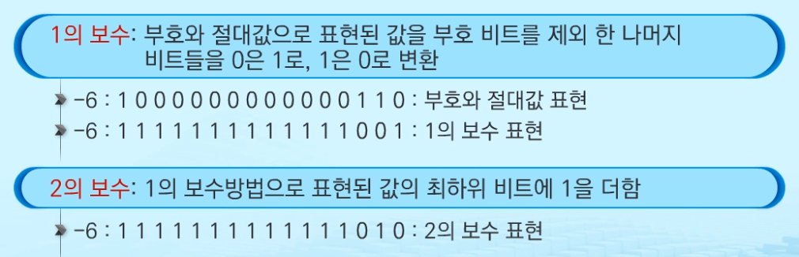

# 2019.09.11) APS응용 - 10. 비트연산, 진수

## 비트 연산



비트 연산자는 다른 연산자들에 비해 실행 시간이 짧음

연산 속도를 향상시키거나 메모리 절약 가능


### `1 << n`

2^n의 값을 가짐

원소가 n개일 경우의 모든 부분집합의 수를 의미

모든 부분 집합

- 공집합과 자기 자신을 포함한 모든 부분집합
- 각 원소가 포함되거나 포함되지 않은 2가지 경우의 수를 계산하면 모든 부분집합의 수가 계산됨


### `i & (1 << j)`

i의 j번째 비트가 1인지 아닌지를 의미


### 비트 연산

```python
for i  in range(int(N)):
        if '0' <= num[i] <= '9':
            digit = ord(num[i]) - ord('0')
        elif 'A' <= num[i] <= 'F':
            digit = ord(num[i]) - ord('A') + 10
        for j in range(3, -1, -1):
            if digit & (1 << j) == 0:
                print('0', end="")
            else:
                print('1', end="")
```

```python
bin(int(char, 16))
```


## 진수

### 10진수를 타 진수로 변환

: 원하는 타진법의 수로 나눈 뒤 나머지를 거꾸로 읽는다.


### 타 진수를 10진수로 변환

: 각 자리값을 행당 진수의 값을 곱해서 구함


2진법 > 8 진법 : 3자리 묶음

2진법 > 16진법 : 4자리 묶음


### 음의 정수 표현 방법




## 실수

