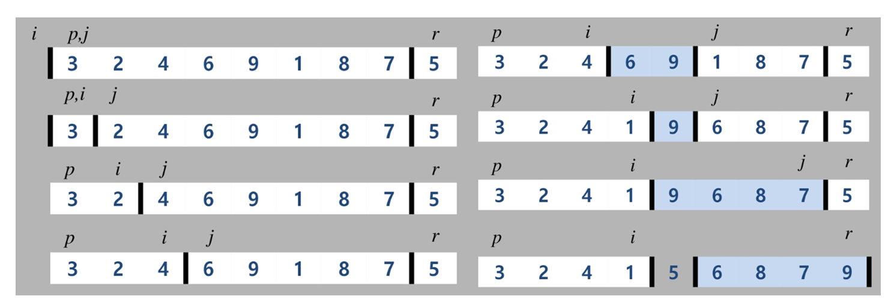

# 2019.09.18) APS응용 - 12. 분할 정복

## 분할 정복

분할(Divide) : 해결할 문제를 여러 개의 작은 부분으로 나눈다.

정복(Conquer) : 나눈 작은 문제를 각각 해결한다.

통합(Combine) : (필요하다면) 해결된 해답을 모은다.

```python
# 반복 알고리즘 >> O(n)
def lterative_power(C, n):
	result = 1
    for _ in range(n):
        result = result*C
    return result

# 분할 정복 기반의 알고리즘 >> O(log2n)
def Recursive_power(C, n):
    if n == 1:
        return C
    if n % 2 == 0:
        y = Recursive_power(C, n/2)
        return y*y
    else:
        y = Recursive_power(C, (n-1)/2)
        return y*y*C
```


### 퀵 정렬

주어진 리스트를 두 개로 분할하고, 각각을 정렬

병합정렬은 두 부분으로 나누기만 해서 후처리로 병합작업이 필요하다.

퀵 정렬은 분할시 피봇을 중심으로 작은 것을 왼편, 큰 것을 오른편으로 위치하기 때문에 후처리 작업이 필요하지 않다.

```python
N = int(input())
a = list(map(int, input().split()))
l, r = 0, N-1
quicksort(a, l, r)
```

```python
# quick
def quicksort(a, l, r):
    if l < r:
        s = partition(a, l, r)
        quicksort(a, l, s-1)
        quicksort(a, s+1, r)
```

```python
# hoare-partition
def partition(A, l, r):
    p = A[l]  # p : 피봇 값
    i = l + 1  # 첫 번째 값은 피봇으로 사용함
    j = r
    while i <= j:
        while i<= j and A[i] <= p:
            i += 1
        while i <= j and A[j] >= p:
            j -= 1
        if i <= j:
            A[i], A[j] = A[j], A[i]
    A[l], A[j] = A[j], A[l]
   	return j
```



```python
# 로무토 파티션
def partition(a, l, r):
    p = a[r]     # x : 오른쪽 끝 값 피봇 설정
    i = l - 1    # i : 시작위치 - 1
    for j in range(l, r):   # j : 시작위치부터 피봇위치 앞까지 증가
        if a[j] <= p:   # 피봇보다 작으면
            i += 1
            a[i], a[j] = a[j], a[i]
    a[i+1], a[r] = a[r], a[i+1]  
   	return i + 1
```

i : 피봇 보다 작은 마지막 값

j : 피봇 보다 큰 마지막 값


### 병합 정렬

여러 개의 정렬된 자료의 집합을 병합하여 한 개의 정렬된 집합으로 만드는 방식

```python
# 분할 과정
def merge_sort(m):
    if len(m) <= 1:  # 사이즈가 0이거나 1인 경우, 바로 리턴
        return m
  	
    # 1. divide 부분
    mid = len(m)//2
    left = m[:mid]
    right = m[mid:]
    
    # 리스트의 크기가 1이 될 때까지 merge_sort 재귀 호출
    left = merge_sort(left)
    right = merge_sort(right)
    
    # 2. conquer 부분 : 할당된 리스트들 병합
    return merge(left, right)
```

```python
# 병합 과정
def merge(left, right):
    result = []  # 두 개의 분할된 리스트를 병합하여 result를 만듦

    while len(left) > 0 or len(right) > 0:  
        if len(left) > 0 and len(right) > 0:  # 양쪽 리스트에 원소가 남아있는 경우
            # 두 서브 리스트의 첫 원소들을 비교하여 작은 것부터 result에 추가함
            if left[0] <= right[0]:
                result.append(left.pop(0))
            else:
                result.append(right.pop(0))
        if len(left) > 0:  # 왼쪽 리스트에 원소가 남아있는 경우
            result.extend(left)
        if len(right) > 0:  # 오른쪽 리스트에 원소가 남아있는 경우
            result.extend(right)
    return result
```


### 이진검색

자료의 가운데에 있는 항목의 키 값과 비교하여 다음 검색의 위치를 결정하고 검색을 계속 진행(반씩 줄어듬)

자료가 정렬 상태여야 함

자료 삽입, 삭제 발생 시 리스트의 상태를 항상 정렬 상태로 유지하는 추가 작업이 필요

#### 이진 검색 : 반복구조

```python
# a : 검색할 리스트, key : 검새하고자 하는 값
def binarysearch(a, key):
    start = 0
    end = len(a) - 1
    while start <= end:
        middle = start + (end - start)//2
        if key == a[middle]:  # 검색 성공
            return middle
        elif key < a[middle]:
            end = middle - 1
        else:
            start = middle + 1
       return -1  # 검색 실패
```

#### 이진검색 : 재귀구조

```python
# a : 검색할 리스트, key : 검새하고자 하는 값
def binarysearch2(a, low, high, key):
	if low > high:  # 검색 실패
        return -1   # False
    else:
        middle = (low + high) // 2
        if key == a[middle]:
            return middle
        elif key < a[middle]:
            return binarysearch2(a, low, middle-1, key)
        else:
            return binarysearch2(a, middle+1, high, key)
```
