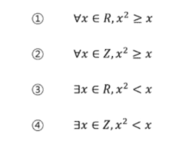

# 2019.10.01 ) Computational Thinking

## 0. 서론 - 프로그래밍과 논리/수학

## 논리

- Hard

카드문제


- soft Logic

맥주집 문제


두 문제는 완전히 같은 문제이다. (논리적 구성이 동일)

그런데 맥주집 문제가 풀기 쉽다면 논리를 사용한 것이 아니다. 직관을 사용한것이다.

직관은 익숙한 상황에서 빠르지만 정확하지 않으며 착각을 일으킨다.


프로그래밍은 Hard Logic을 사용한다. (알고리즘)

알고리즘 이해가 안되는 이유는 증명을 안 했기 때문이다.


### 논리 연습

- `p -> q`  == `~g -> ~p`   : 대우는 참

```
P	Q	P -> Q		~P	~Q	 ~P -> ~Q  
T	T	   T		 F	 F	    T
T	F	   F		 F	 T	    T
F	T	   T		 T	 F	    F
F	F	   T		 T	 T	    T
```

- `P V Q` == 논리합 OR           `P ^ Q` == 논리곱 AND

```
P	Q	PVQ		P^Q
T	T	T		T
T	F	T		F
F	T	T		F
F	F	F		F
```

- 역, 이, 대우

```
P  ->  Q : 명제
Q  ->  P : 역(cONVERSE)
~Q -> ~P : 대우(CONTRAPOSITION)
~P -> ~Q : 이(INVERSE)
```

- 항진명제 : 모두 참(결과), 모순명제 : 모두 거짓(결과)

- 드모르간의 법칙

```
ㄱ(P ^ Q) == ㄱP V ㄱQ
ㄱ(P V Q) == ㄱP ^ ㄱQ
```

- 분배법칙, 결합법칙, 흡수법칙


#### 문제1 : 다음을 명제식 형태로 쓰고 참인지 거짓인지 판단하시오.

1. 만약 0이 홀수라면, 미국에서 2080년 월드컵이 열린다.

   P거짓							Q알 수 없음

   P 명제가 거짓이므로, Q 명제의 참/거짓 여부에 상관없이 해당 명제식은 참이다.

2.  만약 19893827938274839가 PRIME NUMBER라면, 2는 짝수이다.

   P알 수 없음																			Q참

   대우 명제는 ~Q -> ~P인데, ~Q는 거짓인 명제가 되어 ~P 명제의 참/거짓 여부에 상관없이 해당 명제식은 참이 된다.

   대우 명제식이 참이므로, 본 명제식 또한 참이다.


#### 문제2: P와 Q가 명제이고, P -> Q가 거짓이라고 하자. 다음 명제식의 참 거짓은 어떻게 되는가?

```
P -> Q
T	F		F
```


1. ~P -> Q

```
F	F	=> T
```

2. P V Q

```
T OR F	=> T
```

3. Q -> P

```
F	T	=> T
```


#### 문제3: 다음 명제들의 역, 이, 대우를 쓰시오

1. 만약 0이 홀수라면, 미국에서 2080년 월드컵이 열린다.

```
역 : 만약 미국에서 2080년 월드컵이 열린다면, 0이 홀수이다.
이 : 만약 0이 홀수가 아니라면, 미국에서 2080년 월드컵이 열리지 않는다.
대우 : 만약 미국에서 2080년 월드컵이 열리지 않는다면, 0은 홀수가 아니다.
```

2. 만약 19893827938274839가 PRIME NUMBER라면, 2는 짝수이다.

```
역 : 만약 2가 짝수라면, 19893827938274839가 PRIME NUMBER이다.
이 : 만약 19893827938274839가 PRIME NUMBER가 아니라면, 2가 짝수가 아니다.
대우 : 만약 2가 짝수가 아니라면, 19893827938274839가 PRIME NUMBER가 아니다.
```


#### 문제4: 다음 명제식의 진리표를 만드시오

1. P ^ (Q -> ~P)

```
P	Q	~P	Q->~P	P^(Q->~P)	
T	T	F	F		F
T	F	F	T		T
F	T	T	T		F
F	F	T	T		F
```

2. (P^~Q) -> R

```
P	Q	R	~Q	(P^~Q)	(P^~Q) -> R)
T	T	T	F	  F			T
T	T	F	F	  F			T
T	F	T	T	  T			T
T	F	F	T	  T			F
F	T	T	F	  F			T
F	T	F	F	  F			T
F	F	T	T	  F			T
F	F	F	T	  F			T
```


## 증명

증명은...시험에 중요하지 않다. 풀이과정을 기억하고 계산하여 비교하기


증명은 정확한 명제식으로 표현할 수 있음


- 모든 당구공은 색이 같다는 다음 증명에서 잘못된 것은?

수학적 귀납법 : P(1)이 참이고, P(N) -> P(N+1)이 참이면 P(N)은 모든 자연수 N에 대해서 참이다.

모든 자연수 N에 대해 당구공 N개가 들어있는 집합에서 그 집합에 포함된 당구공은 모두 색이 같다는 것을 증명함

P(1): 당구공 1개가 들어있는 집합은 모두 색이 같음

P(N)->P(N+1)을 증명하기 위해 P(N)이 참이라고 가정

당구공 N+1개가 들어있는 임의의 집합을 생각함

이 집합에서 하나를 빼면 당구공 N개가 있는 집합이 되므로 지금 상황에서 모든 당구공의 색이 같음

방금 뺀 원소를 다시 넣고, 다른 당구공을 빼면 역시 당구공 N개가 있는 집합이 되므로 지금 상황에서도 모든 당구공의 색이 같음

`위의 두 상황에서 처음 뺀 당구공과 두번째로 뺀 당구공의 색이 같음을 알 수 있으므로` 당구공 N+1개가 들어있는 임의의 집합은 색이 같은 것만을 포함함 -> N = 1인 경우, N+1 = 2인 경우 공통 부분이 없음

대부분의 사람들이 P(N)이 참이라고 가정할 수 없다고 반론함

수학적 귀납법에서 필요한 것은 P(N)->P(N+1)이 참임을 보이는 것뿐이므로 P(N)이 정말로 참일 필요는 없음


- PRIME NUMVER의 개수가 무한히 많다는 다음 증명은 옳은가?

`PRIME NUMVER의 개수가 유한한 K개라고 가정` -> 명제가 항상 거짓일 수 밖에 없다.

모든 PRIME NUMVER를 다 곱하고 1을 더한 수를 N이라고 하자

이 수 N은 어떤 PRIME으로 나누어도 나머지가 1이다.

그런데 N은 어떤 PRIME보다도 크므로 합성수이다.

합성수이지만 어떤 PRIME으로도 나누어지지 않으므로 모순 발생 


### 수학적 귀납법과 증명의 수준

- 수학적 귀납법의 기본형

P(1)이 참이고, P(N) -> P(N+1)이 참이면 P(N)은 모든 자연수 N에 대해서 참이다.

- 수학적 귀납법의 강한 형태

P(1)이 참이고, P(1)^P(2)^....^P(N) -> P(N+1)이 참이면 P(N)은 모든 자연수 N에 대해서 참이다.


- 다음 함수가 1부터 X까지의 합을 계산함을 증명해보자

```C++
int sum(int x)
{
    if (x<=0) return 0;
    return x + sum(x-1);
}
```

sum(x)가 리턴하는 값은 1+2+....+x의 값과 항상 같다. 는 것을 증명하기


p(1)이 참이다 : sum(1)이 리턴하는 값은 1이다.

p(x-1) -> p(x)이 참이다 : sum(x-1)이 1+2+...+(x-1)을 리턴하면, sum(x)는 1+2+....+x를 리턴한다.

sum(x)는 x + sum(x-1)의 값을 리턴한다.

sum(x-1)의 리턴 값은 1+2+...+x를 리턴함


### 증명 연습

x, P(X) -> Q(X)를 증명하려는데, Q(X)가 항상 참인 경우

문제1 : 다음 명제를 증명하시오

1. 실수 X에 대해, 만약 X<-1이면 X^2+1/4>0이다.

   X^2>-1/4이고, X는 실수이므로 Q(X)는 항상 참이다.

2. N이 홀수이면 4N^3+6N^2+12는 짝수이다.

   2(2N^3+3N^2+6)이므로 짝수이다. 참


x, P(X) -> Q(X)를 증명하려는데, P(X)가 항상 거짓인 경우

문제2 : 다음 명제를 증명하시오

1. 실수 X에 대해, 만약 2X^2-4X+4<0이면 X>8이다.

   2(X-1)^2+2>=0 이므로 P(X)는 거짓, 명제는 참
   
2. 4N^3+6N^2+11짝이면, N이 홀수이다.
   

2(2N^3+3N^2+5)+1이므로 홀수, P(X)는 거짓이므로 명제는 참


## 1. 논리와 증명   

문제1: 다음 명제들이 항진명제라는 것을 진리표를 이용해서 보이시오

1.  ~(P^Q)VQ

   ```
P	Q	(P^Q)	~(P^Q)	 ~(P^Q)VQ
   T	T	T		F		T
   T	F	F		T		T
   F	T	F		T		T
   F	F	F		T		T
   ```
   
2. (~PVQ)V(P^~Q)

   ```
   P	Q	~P	~Q	(~PVQ)	(P^~Q)	(~PVQ)V(P^~Q)
   T	T	F	F	T		F		T
   T	F	F	T	T		T		T
   F	T	T	F	T		F		T
   F	F	T	T	T		F		T
   ```

   

문제2 : 다음 명제들이 모순명제라는 것을 진리표를 이용해서 보이시오.

1. (~PVQ)^(P^~Q)

````
P	Q	~P	~Q	(~PVQ)	(P^~Q)	(~PVQ)^(P^~Q)
T	T	F	F		T		F		F		
F	T	T	F		T		F		F
T	F	F	T		F		T		F	
F	F	T	T		T		F		F
````

2. (P^Q)^(P^~Q)

```
P^(Q^~Q)
P^F
F
```


문제3: 다음 명제의 쌍 들에 대해서 두 명제가 동등한지를 진리표를 이용해 확인하시오.

1. P^(PVQ)	P

```
P	Q	(PVQ)	P^(PVQ)
T	T	T		T	
F	T	T		F	
T	F	T		T
F	F	F		F
```

2. ~PV~Q	 ~(PVQ) : NO

   ```
   P	Q	~P	~Q	(PVQ)	~PV~Q	~(PVQ)
   T	T	F	F	T		F		F
   T	F	F	T	T		T		F
   F	T	T	F	T		T		F
   F	F	T	T	F		T		T
   ```


문제4: 명제식의 변형을 통하여 다음 명제를 간소화하시오.

1. (P^~Q) V (P^Q)

   ```
   P^(~QVQ)
   P^T
   P
   ```

2. (PV~Q)^(~PV~Q)

   ```
   ~QV(P^~P)
   ~QVF
   ~Q
   ```


문제5: 다음 명제들이 참인지 확인하시오. 단, R은 실수의 집합을 의미하고, Z는 정수의 집합을 의미한다.



1. 0~1사이에 만족하지 않음

2. 정수인 경우는 참

3. 어떤 실수 -> 0

4. 어떤 정수 -> X


문제6: (직접증명) N이 짝수이면 3N+5는 홀수임을 증명하라.

```
N = 2K
6K+5 = 2(3K+2)+1 = 홀수
```


문제7: N이 홀수이면 N^2+N이 짝수임을 증명하라

```
N = 2K+1
4K^2+4K+1 + 2K+1 = 2(2K^2+3K+1) = 짝수
```


문제8: M이 짝수이고 N이 홀수이면 2M+3N은 홀수임을 증명하라

```
M = 2K, N = 2T+1
4K+6T+3 = 2(2K+3T+1)+1 = 홀수
```


문제9:(대우를 증명) 자연수 N에 대해, N^2+5가 홀수이면 N은 짝수임을 증명하라

```
대우 : N이 홀수이면, N^2+5가 짝수이다.
N = 2K+1
4K^2+4K+6 = 2(2K^2+2K+3) = 짝수 = 참
```


문제10: N^2이 짝수이면 N은 짝수임을 증명하라

```
대우 : N이 홀수이면, N^2이 홀수이다.
N = 2K+1
2(2K^2+2K)+1 = 홀수 = 참
```


문제11:(경우를 나누어 증명) 자연수 N에 대해 N^2+5N+3은 항상 홀수임을 증명하라

```
N 홀수 -> 2K+1
4K^2+4K+1+10K+1+3 = 2(2K^2+7K+2)+1 = 홀수
```

```
N 짝수 -> 2K
4K^2+10K+3 = 2(2K^2+5K+1)+1 = 홀수
```


문제12: N^2이 3의 배수이면, N은 3의 배수임을 증명하라

```
N이 3의 배수가 아니라면, N^2는 3의 배수가 아니다.
1. N = 3K+1
9K^2+6K+1 = 3(3K^2+2K)+1
2. N = 3K+2
9K^2+12K+4 = 3(3K^2+4K+1)+1
```


문제13 : N이 홀수이면 N^2을 8로 나눈 나머지는 1임을 증명하라

(N을 4로 나눈 나머지가 1인 경우와 3인 경우로 나누어 보자)

```
1. N = 4K+1 = 2K+2K+1
16K^2+8K+1 = 8(2K^2+K)+1
2. N = 4K+3 = 2K+1+2K+2
16K^2+24K+9 = 8(2K^2+3K+1)+1
1의 8K와 2의 24K는 8의 배수가 되면서 홀수인것
```


문제14: 어떤 자연수를 제곱하여도 그 결과를 3으로 나눈 나머지는 2가 아님을 증명하라.

```
어떤 자연수 : 3K, 3K+1, 3K+2
제곱해서 3으로 나눈 나머지가 2가 아님을 증명
9K^2 = 3(3K^2)
9K^2+6K+1 = 3(3K^2+2K)+1
9K^2+12K+4 = 3(3K^2+4K+1)+1
```


문제15:(귀류법) 유리수와 무리수의 합은 무리수임을 증명하라.

(힌트:어떤 유리수와 어떤 무리수의 합이 유리수가 된다고 가정하고 모순을 이끌어 낼 수 있는가?)

어떤 유리수와 어떤 무리수의 합이 유리수가 된다고 가정

유리수A, 무리수B가 있고 A와 B의 합은 유리수 C가 된다고 하자.

A+B = C, B=C-A가 되고, 이 때 C-A값인 B는 유리수의 성질에 의해 유리수여야만 한다.(가정에 모순)

따라서 B가 무리수라는 가정에 모순되므로, 유리수와 무리수의 합은 무리수임을 증명할 수 없다.


문제16: 루트2는 무리수임을 증명하라.

(힌트:유리수가 된다는 것은 기약분수로 표현이 된다는 것이다.)

```
만약 루트2가 유리수라면 
루트2 = B/A(A,B는 서로소인 정수)
2A^2 = B^2 
2의 배수 => B^2 짝수 => B 짝수 => A^2짝수 => A짝수
A와 B가 서로소에 모순
```


문제17: 로그2의5는 무리수임을 증명하라

```
로그2의5 = B/A ( A,B서로소 )
2^B = 5*2^A
A,B는 서로소인 정수가 아님
```


문제18:(수학적 귀납법)


