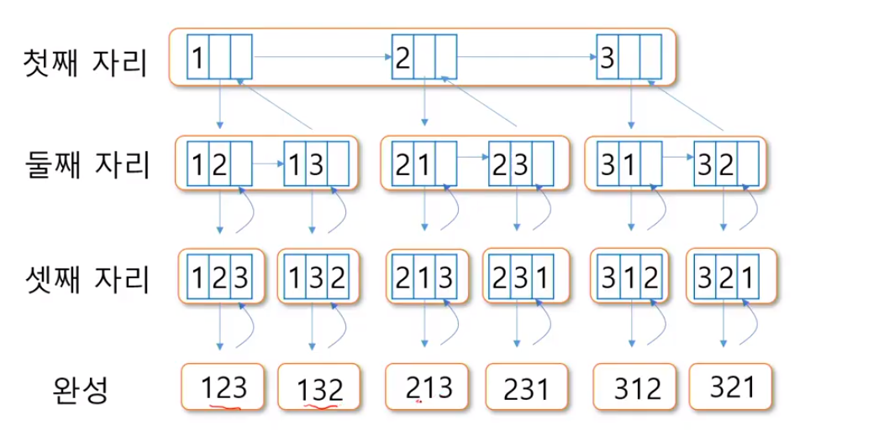
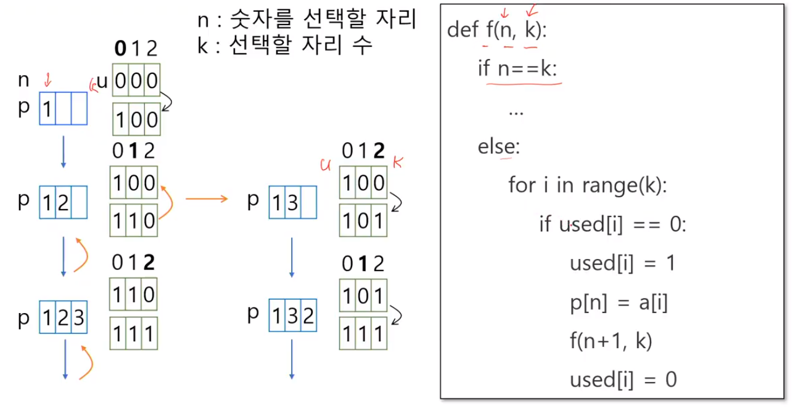

# 순열

### 1, 2, 3 으로 순열 만들기





```python
def f(n, k):  # 순열의 n번 원소 결정
    if n == k:
        print(p)
    else:
        for i in range(k):
            if used[i] == 0:  # i번 원소가 사용되지 않았으면
                used[i] = 1  # 사용함으로 표시
                p[n] = A[i]
                f(n + 1, k)  # n + 1원소 결정
                used[i] = 0  # 다른 자리에서 사용하도록 풀어줌

A = [1, 2, 3, 4, 5]
used = [0] * 5
p = [0] * 5
f(0, 5)
```


예제)

1865. 동철이의 일 분배