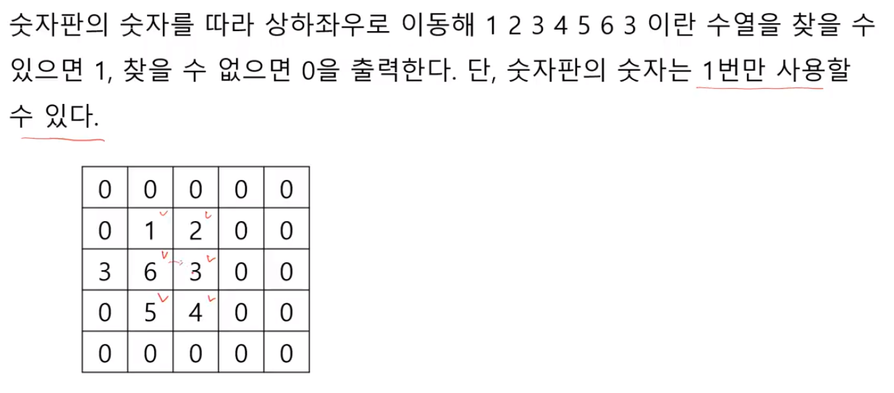
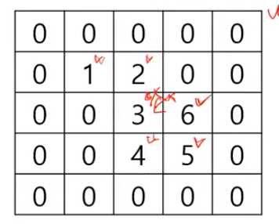
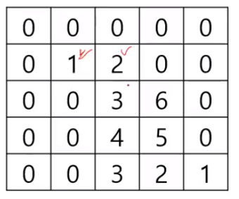

# ㄴ

## 예제





수열을 찾을 수 없는 경우



위에는 실패, 아래쪽은 성공

아래를 찾아가기 전에 방문한 곳 표시 지우기

```python
def dfs(n, k, i, j):
    
	if n == 6:
    	return 1	
	else:
        used[i][j] = 1
        for di, dj in (-1, 0), (1, 0), (0, -1), (0, 1):
            ni, nj = i + di, j + dj
            if 0 <= ni < N and 0 <= nj < N and used[ni][nj] == 0:
                if a[n + 1] == board[ni][nj]:
                    if f(n + 1, k, ni, nj) == 1:
                        return 1
    

N = int(input())
board = [list(map(int, input().split())) for _ in range(N)]
a = [1, 2, 3, 4, 5, 6, 3]

for i in range(N):
    for j in range(N):
        if board[i][j] == a[0]:
            dfs(0, 6, i, j)
```


## 문제

2819. 격자판의 숫자 이어 붙이기